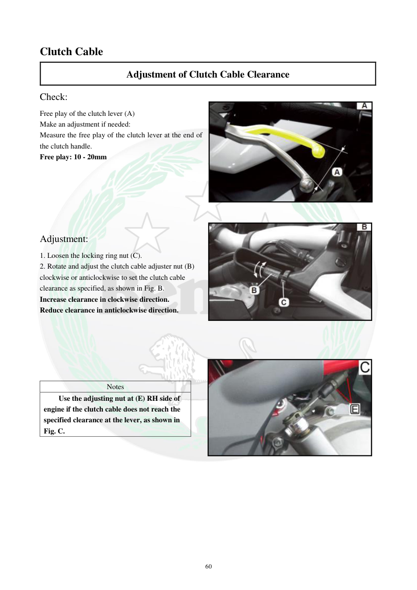

# Manual page 61

> Source: [page-0061.md](../source/page-0061.md)

## Page image / diagram

- [page-0061-img-02.jpeg](../images/embedded/page-0061-img-02.jpeg)

- [page-0061-img-03.jpeg](../images/embedded/page-0061-img-03.jpeg)

- [page-0061-img-04.jpeg](../images/embedded/page-0061-img-04.jpeg)

## Extracted text

# Source page 61

 
60 
Clutch Cable 
Adjustment of Clutch Cable Clearance 
Check: 
Free play of the clutch lever (A) 
Make an adjustment if needed: 
Measure the free play of the clutch lever at the end of 
the clutch handle. 
Free play: 10 - 20mm 
 
 
 
 
 
Adjustment: 
1. Loosen the locking ring nut (C). 
2. Rotate and adjust the clutch cable adjuster nut (B) 
clockwise or anticlockwise to set the clutch cable 
clearance as specified, as shown in Fig. B. 
Increase clearance in clockwise direction. 
Reduce clearance in anticlockwise direction. 
 
 
 
 
 
 
Notes 
Use the adjusting nut at (E) RH side of 
engine if the clutch cable does not reach the 
specified clearance at the lever, as shown in 
Fig. C.

## Persian notes

### ترجمه و توضیح فارسی
**تنظیم خلاصی کلاچ**

- مقدار خلاصی آزاد اهرم کلاچ در انتهای دسته باید **۱۰ تا ۲۰ میلی‌متر** باشد.
- برای تنظیم:
  1. مهره قفل‌کننده **(C)** را شل کنید.
  2. مهره تنظیم کابل کلاچ **(B)** را ساعتگرد یا پادساعتگرد بچرخانید تا خلاصی به مقدار مشخص برسد.
  3. طبق متن منبع، چرخاندن ساعتگرد باعث **افزایش خلاصی** و چرخاندن پادساعتگرد باعث **کاهش خلاصی** می‌شود.
- اگر با تنظیم‌کننده روی دسته، خلاصی به مقدار استاندارد نمی‌رسد، از مهره تنظیم **(E)** در سمت راست موتور استفاده کنید.
- بعد از تنظیم، مهره قفل‌کننده را محکم کنید و عملکرد اهرم کلاچ را بررسی کنید.

**نکته پروژه:** مقدار عددی ۱۰–۲۰ میلی‌متر و جهت تنظیم مستقیماً از منبع ثبت شده و نباید با مقادیر مدل‌های دیگر مخلوط شود.
