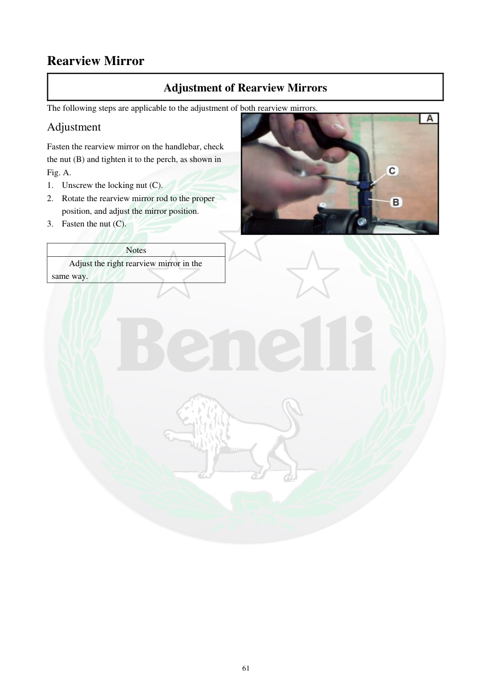

# Manual page 62

> Source: [page-0062.md](../source/page-0062.md)

## Page image / diagram

- [page-0062-img-02.jpeg](../images/embedded/page-0062-img-02.jpeg)

## Extracted text

# Source page 62

 
61 
Rearview Mirror 
Adjustment of Rearview Mirrors 
The following steps are applicable to the adjustment of both rearview mirrors. 
Adjustment 
Fasten the rearview mirror on the handlebar, check 
the nut (B) and tighten it to the perch, as shown in 
Fig. A.  
1. Unscrew the locking nut (C). 
2. Rotate the rearview mirror rod to the proper 
position, and adjust the mirror position. 
3. Fasten the nut (C). 
 
Notes 
Adjust the right rearview mirror in the 
same way.

## Persian notes

### ترجمه و توضیح فارسی
**تنظیم آینه‌های عقب**

این روش برای هر دو آینه قابل استفاده است.

1. آینه را روی فرمان نصب و مهره **(B)** را تا پایه/محل نشیمن محکم کنید.
2. مهره قفل **(C)** را باز کنید.
3. میله آینه را بچرخانید و زاویه آینه را طوری تنظیم کنید که دید مناسب عقب فراهم شود.
4. مهره **(C)** را دوباره محکم کنید.
5. آینه سمت راست نیز به همین روش تنظیم می‌شود.

**نکته پروژه:** این صفحه بیشتر یک روش تنظیم مکانیکی ساده است و تصویر صفحه برای تشخیص دقیق محل مهره‌های B و C مرجع اصلی است.
