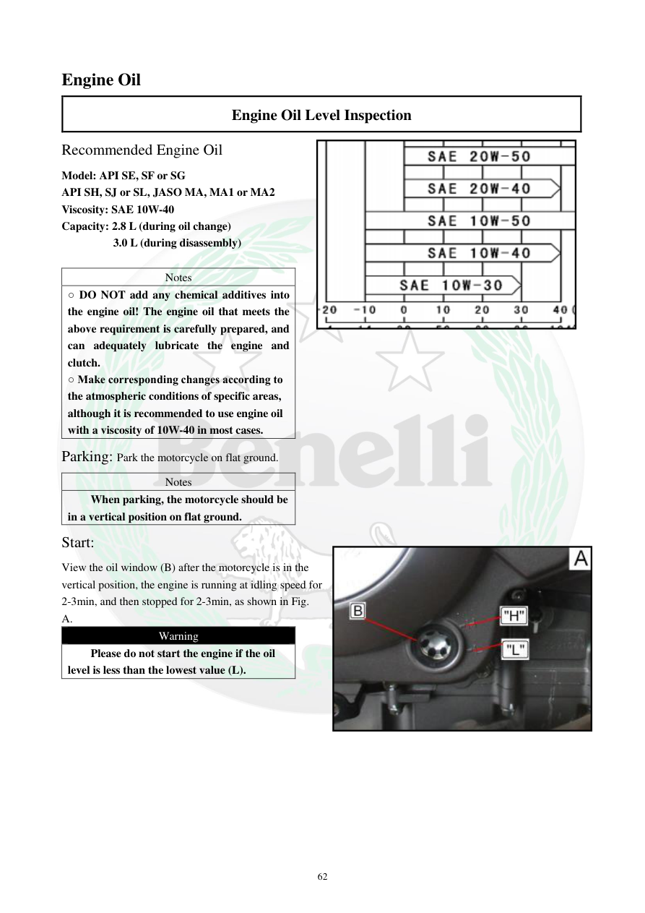

# Manual page 63

> Source: [page-0063.md](../source/page-0063.md)

## Page image / diagram

- [page-0063-img-02.png](../images/embedded/page-0063-img-02.png)

- [page-0063-img-03.jpeg](../images/embedded/page-0063-img-03.jpeg)

## Extracted text

# Source page 63

 
62 
Engine Oil 
Engine Oil Level Inspection 
Recommended Engine Oil  
Model: API SE, SF or SG 
API SH, SJ or SL, JASO MA, MA1 or MA2 
Viscosity: SAE 10W-40 
Capacity: 2.8 L (during oil change) 
         3.0 L (during disassembly) 
 
Notes 
○ DO NOT add any chemical additives into 
the engine oil! The engine oil that meets the 
above requirement is carefully prepared, and 
can adequately lubricate the engine and 
clutch. 
○ Make corresponding changes according to 
the atmospheric conditions of specific areas, 
although it is recommended to use engine oil 
with a viscosity of 10W-40 in most cases. 
Parking: Park the motorcycle on flat ground. 
Notes 
When parking, the motorcycle should be 
in a vertical position on flat ground. 
Start: 
View the oil window (B) after the motorcycle is in the 
vertical position, the engine is running at idling speed for 
2-3min, and then stopped for 2-3min, as shown in Fig. 
A.  
Warning 
Please do not start the engine if the oil 
level is less than the lowest value (L).

## Persian notes

### ترجمه و توضیح فارسی
**بازرسی سطح روغن موتور و مشخصات روغن**

مشخصات درج‌شده در این صفحه:
- استاندارد روغن: **API SE, SF یا SG** و **API SH, SJ یا SL**، با **JASO MA / MA1 / MA2**
- گرانروی توصیه‌شده: **SAE 10W-40**
- حجم هنگام تعویض روغن: **۲.۸ لیتر**
- حجم هنگام باز شدن کامل موتور: **۳.۰ لیتر**

**روش کنترل سطح روغن:**
1. موتورسیکلت را روی سطح صاف قرار دهید.
2. موتور باید کاملاً در وضعیت عمودی باشد، نه روی جک بغل.
3. موتور را روشن کنید و حدود **۲ تا ۳ دقیقه در دور آرام** کار کند.
4. موتور را خاموش کنید و **۲ تا ۳ دقیقه** صبر کنید تا روغن به کارتل برگردد.
5. سطح روغن را از پنجره بازدید بررسی کنید.

**هشدار:** اگر سطح روغن پایین‌تر از علامت **L** باشد، موتور را روشن نکنید.

**نکته مهم:** دفترچه صراحتاً اضافه کردن مواد افزودنی شیمیایی به روغن را منع می‌کند. دلیل مهم آن این است که همین روغن، کلاچ را نیز روانکاری می‌کند و روغن نامناسب یا دارای افزودنی می‌تواند روی عملکرد کلاچ اثر بگذارد.

**نکته پروژه:** اعداد بالا به‌عنوان داده رسمی دفترچه ثبت شده‌اند؛ برای TNT249 نباید بدون تطبیق با مشخصات مدل، خودکار تعمیم داده شوند.
