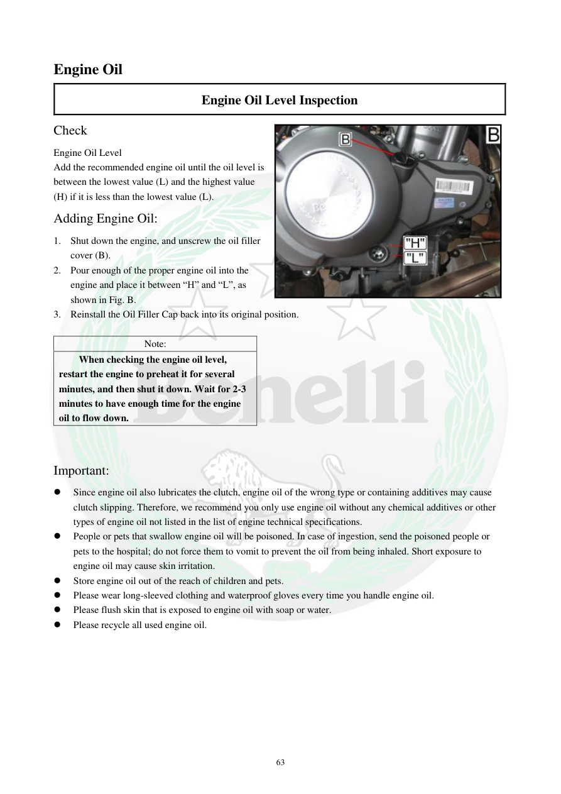

# Manual page 64

> Source: [page-0064.md](../source/page-0064.md)

## Page image / diagram

- [page-0064-img-01.jpeg](../images/embedded/page-0064-img-01.jpeg)

## Extracted text

# Source page 64

 
63 
Engine Oil 
Engine Oil Level Inspection 
Check 
Engine Oil Level 
Add the recommended engine oil until the oil level is 
between the lowest value (L) and the highest value 
(H) if it is less than the lowest value (L). 
Adding Engine Oil: 
1. Shut down the engine, and unscrew the oil filler 
cover (B). 
2. Pour enough of the proper engine oil into the 
engine and place it between “H” and “L”, as 
shown in Fig. B. 
3. Reinstall the Oil Filler Cap back into its original position. 
 
Note: 
When checking the engine oil level, 
restart the engine to preheat it for several 
minutes, and then shut it down. Wait for 2-3 
minutes to have enough time for the engine 
oil to flow down. 
 
Important: 
 
Since engine oil also lubricates the clutch, engine oil of the wrong type or containing additives may cause 
clutch slipping. Therefore, we recommend you only use engine oil without any chemical additives or other 
types of engine oil not listed in the list of engine technical specifications. 
 
People or pets that swallow engine oil will be poisoned. In case of ingestion, send the poisoned people or 
pets to the hospital; do not force them to vomit to prevent the oil from being inhaled. Short exposure to 
engine oil may cause skin irritation. 
 
Store engine oil out of the reach of children and pets. 
 
Please wear long-sleeved clothing and waterproof gloves every time you handle engine oil. 
 
Please flush skin that is exposed to engine oil with soap or water. 
 
Please recycle all used engine oil.

## Persian notes

### ترجمه و توضیح فارسی
**کنترل و اضافه کردن روغن موتور**

- سطح روغن باید بین علامت‌های **L (حد پایین)** و **H (حد بالا)** قرار داشته باشد.
- اگر سطح پایین‌تر از L است، روغن توصیه‌شده را اضافه کنید تا سطح به محدوده بین H و L برسد.

**روش اضافه کردن روغن:**
1. موتور را خاموش کنید.
2. درپوش پرکن روغن **(B)** را باز کنید.
3. مقدار لازم روغن مناسب را اضافه کنید.
4. سطح را بین H و L قرار دهید و درپوش را دوباره نصب کنید.

برای کنترل مجدد، موتور را چند دقیقه گرم کنید، خاموش کنید و **۲ تا ۳ دقیقه** صبر کنید تا روغن پایین برگردد.

**هشدارهای سرویس روغن:**
- روغن نامناسب یا دارای افزودنی می‌تواند باعث **لغزش کلاچ** شود.
- تماس روغن با پوست می‌تواند باعث تحریک پوستی شود؛ استفاده از دستکش ضدآب و لباس آستین‌بلند توصیه شده است.
- روغن را دور از دسترس کودک و حیوان نگه دارید.
- روغن مصرف‌شده باید برای بازیافت تحویل شود.
- در صورت بلعیدن روغن، طبق هشدار دفترچه نباید فرد را وادار به استفراغ کرد و باید کمک پزشکی دریافت شود.
