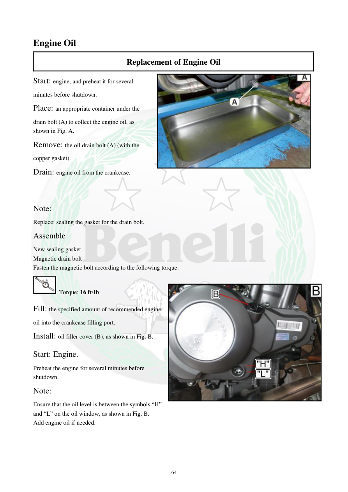

# Manual page 65

> Source: [page-0065.md](../source/page-0065.md)

## Page image / diagram

- [page-0065-img-01.png](../images/embedded/page-0065-img-01.png)

- [page-0065-img-02.jpeg](../images/embedded/page-0065-img-02.jpeg)

- [page-0065-img-03.jpeg](../images/embedded/page-0065-img-03.jpeg)

## Extracted text

# Source page 65

 
64 
Engine Oil 
Replacement of Engine Oil 
Start: engine, and preheat it for several 
minutes before shutdown. 
Place: an appropriate container under the 
drain bolt (A) to collect the engine oil, as 
shown in Fig. A.  
Remove: the oil drain bolt (A) (with the 
copper gasket). 
Drain: engine oil from the crankcase. 
 
Note: 
Replace: sealing the gasket for the drain bolt. 
Assemble 
New sealing gasket 
Magnetic drain bolt 
Fasten the magnetic bolt according to the following torque: 
 Torque: 16 ft·lb 
Fill: the specified amount of recommended engine 
oil into the crankcase filling port. 
Install: oil filler cover (B), as shown in Fig. B. 
Start: Engine. 
Preheat the engine for several minutes before 
shutdown. 
Note: 
Ensure that the oil level is between the symbols “H” 
and “L” on the oil window, as shown in Fig. B. 
Add engine oil if needed.

## Persian notes

<!-- Persian translation/explanation will be added here. -->
