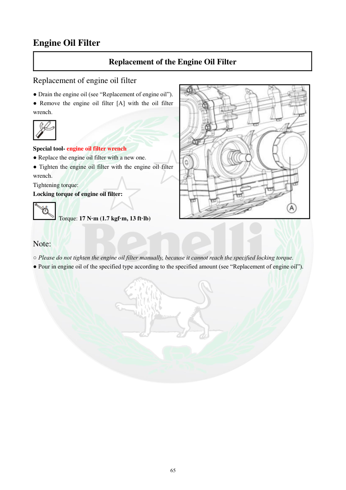

# Manual page 66

> Source: [page-0066.md](../source/page-0066.md)

## Page image / diagram

- [page-0066-img-02.png](../images/embedded/page-0066-img-02.png)

- [page-0066-img-03.jpeg](../images/embedded/page-0066-img-03.jpeg)

## Extracted text

# Source page 66

 
65 
Engine Oil Filter 
Replacement of the Engine Oil Filter 
Replacement of engine oil filter 
● Drain the engine oil (see “Replacement of engine oil”). 
● Remove the engine oil filter [A] with the oil filter 
wrench. 
 
Special tool- engine oil filter wrench 
● Replace the engine oil filter with a new one. 
● Tighten the engine oil filter with the engine oil filter 
wrench. 
Tightening torque: 
Locking torque of engine oil filter: 
 Torque: 17 N·m (1.7 kgf·m, 13 ft·lb) 
        
Note: 
○ Please do not tighten the engine oil filter manually, because it cannot reach the specified locking torque. 
● Pour in engine oil of the specified type according to the specified amount (see “Replacement of engine oil”).

## Persian notes

### ترجمه و توضیح فارسی
**تعویض فیلتر روغن موتور**

1. ابتدا روغن موتور را طبق روش صفحه تعویض روغن تخلیه کنید.
2. فیلتر روغن **(A)** را با **آچار مخصوص فیلتر روغن** باز کنید.
3. فیلتر قدیمی را با فیلتر جدید تعویض کنید.
4. فیلتر جدید را با آچار مخصوص تا گشتاور مشخص سفت کنید.
5. سپس روغن موتور با مشخصات و مقدار تعیین‌شده را اضافه کنید.

**گشتاور فیلتر روغن:** **17 N·m**، معادل **1.7 kgf·m** یا **13 ft·lb**.

**نکته مهم دفترچه:** فیلتر را با دست سفت نکنید، چون با سفت‌کردن دستی به گشتاور تعیین‌شده نمی‌رسد.
