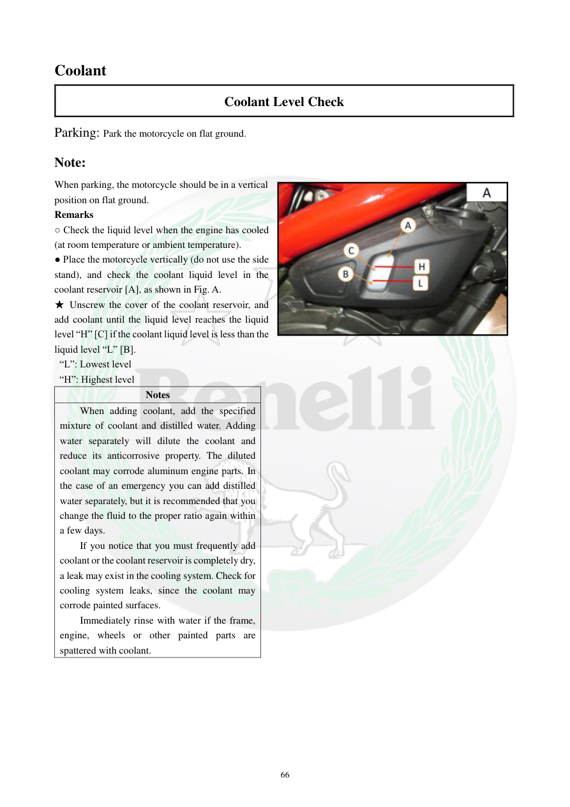

# Manual page 67

> Source: [page-0067.md](../source/page-0067.md)

## Page image / diagram

- [page-0067-img-01.jpeg](../images/embedded/page-0067-img-01.jpeg)

## Extracted text

# Source page 67

 
66 
Coolant 
Coolant Level Check 
Parking: Park the motorcycle on flat ground. 
Note: 
When parking, the motorcycle should be in a vertical 
position on flat ground. 
Remarks 
○ Check the liquid level when the engine has cooled 
(at room temperature or ambient temperature). 
● Place the motorcycle vertically (do not use the side 
stand), and check the coolant liquid level in the 
coolant reservoir [A], as shown in Fig. A. 
★ Unscrew the cover of the coolant reservoir, and 
add coolant until the liquid level reaches the liquid 
level “H” [C] if the coolant liquid level is less than the 
liquid level “L” [B]. 
 “L”: Lowest level 
 “H”: Highest level 
Notes 
When adding coolant, add the specified 
mixture of coolant and distilled water. Adding 
water separately will dilute the coolant and 
reduce its anticorrosive property. The diluted 
coolant may corrode aluminum engine parts. In 
the case of an emergency you can add distilled 
water separately, but it is recommended that you 
change the fluid to the proper ratio again within 
a few days. 
If you notice that you must frequently add 
coolant or the coolant reservoir is completely dry, 
a leak may exist in the cooling system. Check for 
cooling system leaks, since the coolant may 
corrode painted surfaces.  
Immediately rinse with water if the frame, 
engine, wheels or other painted parts are 
spattered with coolant.

## Persian notes

### ترجمه و توضیح فارسی
**بازرسی سطح مایع خنک‌کننده**

- سطح مایع را زمانی بررسی کنید که موتور **سرد** و در دمای محیط باشد.
- موتورسیکلت را روی سطح صاف و در وضعیت کاملاً عمودی قرار دهید؛ از جک بغل برای این بررسی استفاده نکنید.
- سطح مایع را در مخزن انبساط **(A)** بررسی کنید.
- **L** = حداقل سطح
- **H** = حداکثر سطح
- اگر سطح پایین‌تر از L است، درپوش مخزن را باز کرده و مایع خنک‌کننده مناسب را تا H اضافه کنید.

**مخلوط آب و ضدیخ:**
دفترچه تأکید می‌کند از مخلوط تعیین‌شده مایع خنک‌کننده و آب مقطر استفاده شود. اضافه کردن آب به‌تنهایی، غلظت ضدخوردگی را کاهش می‌دهد و می‌تواند به قطعات آلومینیومی آسیب خوردگی وارد کند. آب مقطر تنها در شرایط اضطراری قابل استفاده است و نسبت صحیح باید در چند روز بعد اصلاح شود.

اگر مخزن مرتباً نیاز به پر شدن دارد یا کاملاً خشک می‌شود، احتمال نشتی در سیستم خنک‌کاری وجود دارد و باید سیستم از نظر نشتی بررسی شود. مایع خنک‌کننده روی قطعات رنگ‌شده نیز باید سریعاً با آب شسته شود.
