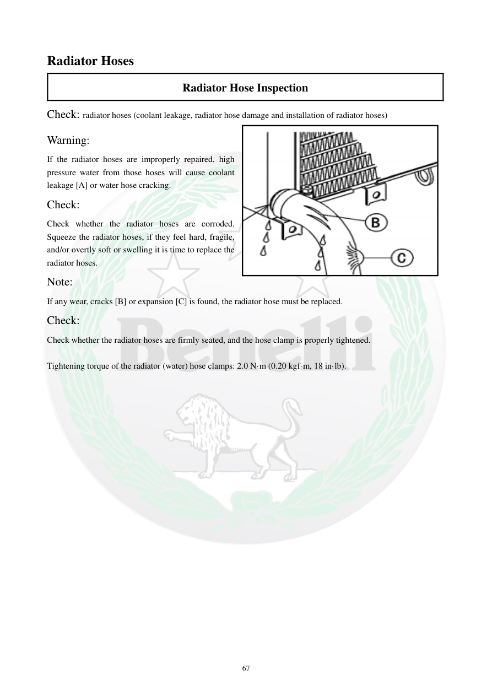

# Manual page 68

> Source: [page-0068.md](../source/page-0068.md)

## Page image / diagram

- [page-0068-img-01.png](../images/embedded/page-0068-img-01.png)

## Extracted text

# Source page 68

 
67 
Radiator Hoses 
Radiator Hose Inspection 
Check: radiator hoses (coolant leakage, radiator hose damage and installation of radiator hoses) 
Warning: 
If the radiator hoses are improperly repaired, high 
pressure water from those hoses will cause coolant 
leakage [A] or water hose cracking. 
Check: 
Check whether the radiator hoses are corroded. 
Squeeze the radiator hoses, if they feel hard, fragile, 
and/or overtly soft or swelling it is time to replace the 
radiator hoses. 
Note: 
If any wear, cracks [B] or expansion [C] is found, the radiator hose must be replaced. 
Check: 
Check whether the radiator hoses are firmly seated, and the hose clamp is properly tightened. 
 
Tightening torque of the radiator (water) hose clamps: 2.0 N·m (0.20 kgf·m, 18 in·lb).

## Persian notes

<!-- Persian translation/explanation will be added here. -->
