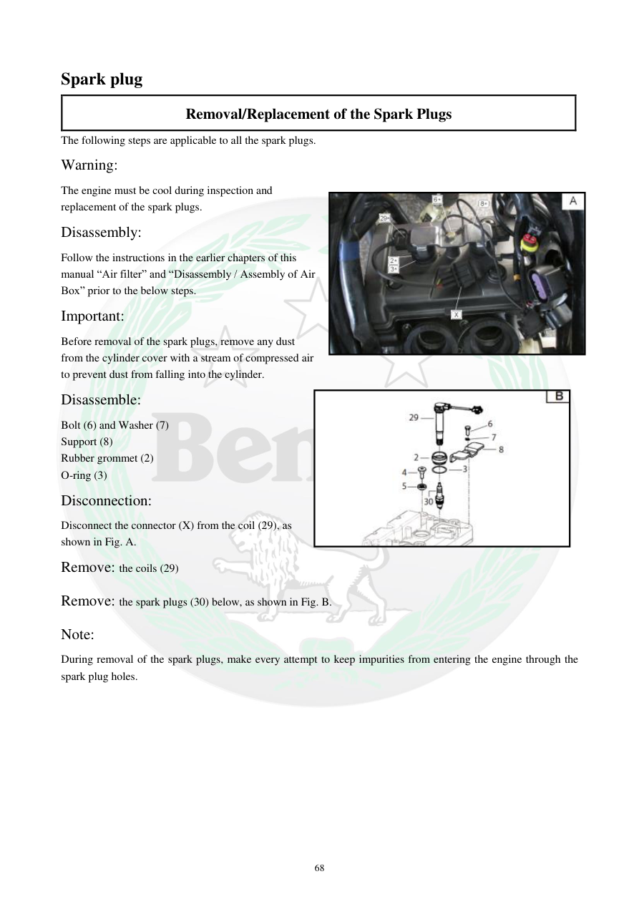

# Manual page 69

> Source: [page-0069.md](../source/page-0069.md)

## Page image / diagram

- [page-0069-img-01.jpeg](../images/embedded/page-0069-img-01.jpeg)

- [page-0069-img-02.jpeg](../images/embedded/page-0069-img-02.jpeg)

## Extracted text

# Source page 69

 
68 
Spark plug 
Removal/Replacement of the Spark Plugs 
The following steps are applicable to all the spark plugs. 
Warning: 
The engine must be cool during inspection and 
replacement of the spark plugs. 
Disassembly: 
Follow the instructions in the earlier chapters of this 
manual “Air filter” and “Disassembly / Assembly of Air 
Box” prior to the below steps. 
Important:  
Before removal of the spark plugs, remove any dust 
from the cylinder cover with a stream of compressed air 
to prevent dust from falling into the cylinder. 
Disassemble: 
Bolt (6) and Washer (7) 
Support (8) 
Rubber grommet (2) 
O-ring (3) 
Disconnection: 
Disconnect the connector (X) from the coil (29), as 
shown in Fig. A.  
Remove: the coils (29) 
Remove: the spark plugs (30) below, as shown in Fig. B.  
Note: 
During removal of the spark plugs, make every attempt to keep impurities from entering the engine through the 
spark plug holes.

## Persian notes

### ترجمه و توضیح فارسی
**باز کردن و تعویض شمع‌ها**

- موتور هنگام بازرسی یا تعویض شمع باید **کاملاً سرد** باشد.
- قبل از رسیدن به مرحله شمع، طبق بخش‌های قبلی دفترچه، مراحل مربوط به **فیلتر هوا و باز کردن/بستن Air Box** را انجام دهید.
- قبل از بیرون آوردن شمع‌ها، گردوغبار روی درپوش سیلندر را با هوای فشرده تمیز کنید تا آلودگی وارد سیلندر نشود.

قطعاتی که در شکل مشخص شده‌اند:
- پیچ **(6)** و واشر **(7)**
- پایه **(8)**
- بوش/لاستیک **(2)**
- اورینگ **(3)**

سپس:
1. سوکت **(X)** را از کویل **(29)** جدا کنید.
2. کویل‌ها **(29)** را خارج کنید.
3. شمع‌ها **(30)** را بیرون بیاورید.

**نکته مهم:** هنگام خارج بودن شمع، مراقب باشید هیچ گردوغبار یا جسم خارجی از سوراخ شمع وارد موتور نشود. تصاویر این صفحه برای تشخیص ترتیب قطعات و محل کویل‌ها مرجع هستند.
