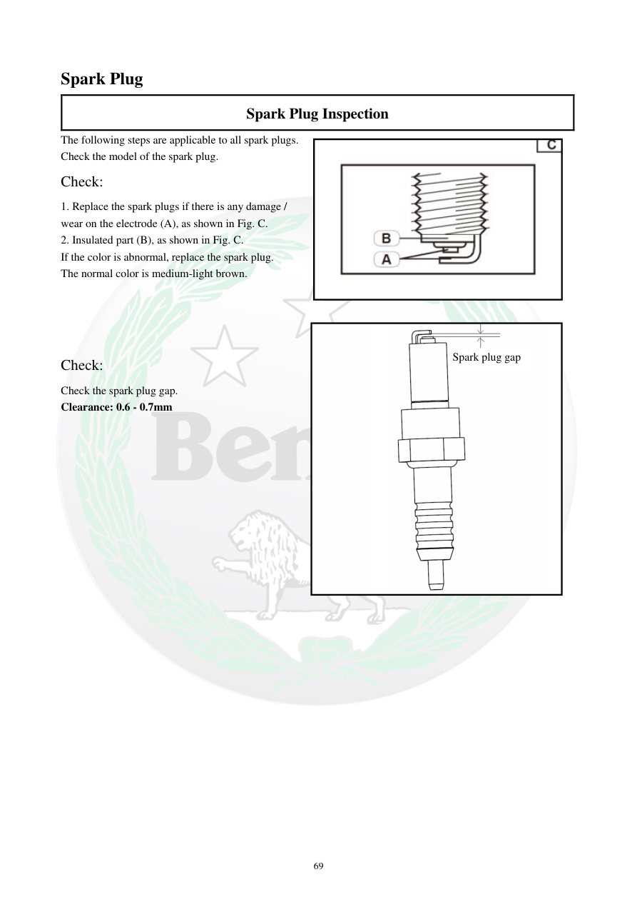

# Manual page 70

> Source: [page-0070.md](../source/page-0070.md)

## Page image / diagram

- [page-0070-img-01.jpeg](../images/embedded/page-0070-img-01.jpeg)

- [page-0070-img-02.png](../images/embedded/page-0070-img-02.png)

## Extracted text

# Source page 70

 
69 
Spark Plug 
Spark Plug Inspection 
The following steps are applicable to all spark plugs. 
Check the model of the spark plug. 
Check: 
1. Replace the spark plugs if there is any damage / 
wear on the electrode (A), as shown in Fig. C. 
2. Insulated part (B), as shown in Fig. C. 
If the color is abnormal, replace the spark plug. 
The normal color is medium-light brown. 
 
 
Check: 
Check the spark plug gap. 
Clearance: 0.6 - 0.7mm 
 
 
 
 
 
 
 
 
 
 
 
 
 
 
 
 
Spark plug gap

## Persian notes

### ترجمه و توضیح فارسی
**بازرسی شمع**

این مراحل برای تمام شمع‌ها انجام می‌شود.

1. مدل شمع را بررسی کنید.
2. الکترود **(A)** را از نظر آسیب و فرسودگی بررسی کنید. در صورت آسیب یا سایش، شمع را تعویض کنید.
3. قسمت عایق **(B)** را بررسی کنید. اگر رنگ آن غیرطبیعی است، شمع را تعویض کنید.
4. رنگ طبیعی شمع طبق دفترچه **قهوه‌ای متوسط تا روشن** است.
5. فاصله دهانه شمع را با فیلر اندازه بگیرید.

**فاصله استاندارد دهانه شمع:** **0.6 تا 0.7 میلی‌متر**

**نکته پروژه:** مقدار 0.6–0.7 mm به‌عنوان مشخصه مستقیم دفترچه ثبت شد و برای TNT249 بدون تطبیق مدل نباید خودکار تغییر داده شود.
