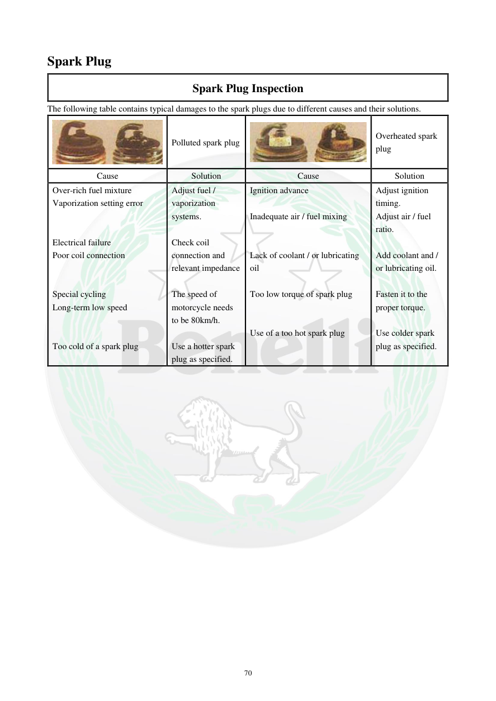

# Manual page 71

> Source: [page-0071.md](../source/page-0071.md)

## Page image / diagram

- [page-0071-img-01.jpeg](../images/embedded/page-0071-img-01.jpeg)

- [page-0071-img-02.jpeg](../images/embedded/page-0071-img-02.jpeg)

## Extracted text

# Source page 71

 
70 
Spark Plug 
Spark Plug Inspection 
The following table contains typical damages to the spark plugs due to different causes and their solutions. 
 
Polluted spark plug 
 
Overheated spark 
plug 
Cause 
Solution 
Cause 
Solution 
Over-rich fuel mixture 
Vaporization setting error 
 
 
Electrical failure 
Poor coil connection 
 
 
Special cycling 
Long-term low speed 
 
 
Too cold of a spark plug 
Adjust fuel / 
vaporization 
systems. 
 
Check coil 
connection and 
relevant impedance 
 
The speed of 
motorcycle needs 
to be 80km/h. 
 
Use a hotter spark 
plug as specified. 
Ignition advance 
 
Inadequate air / fuel mixing 
 
 
Lack of coolant / or lubricating 
oil 
 
Too low torque of spark plug 
 
 
Use of a too hot spark plug 
Adjust ignition 
timing. 
Adjust air / fuel 
ratio. 
 
Add coolant and / 
or lubricating oil. 
 
Fasten it to the 
proper torque. 
 
Use colder spark 
plug as specified.

## Persian notes

### ترجمه و توضیح فارسی
**بررسی خرابی‌های متداول شمع و علت احتمالی**

جدول این صفحه چند حالت رایج را نشان می‌دهد:

- **شمع آلوده:** می‌تواند در اثر مخلوط سوخت بیش‌ازحد غنی، تنظیم نادرست سیستم تبخیر/سوخت، خرابی الکتریکی یا اتصال نامناسب کویل، استفاده طولانی‌مدت در دور پایین و استفاده از شمع بیش‌ازحد سرد ایجاد شود.
- راهکارهای ذکرشده شامل بررسی و تنظیم سیستم سوخت، بررسی اتصال و مقاومت کویل، استفاده از شمع با درجه حرارتی مناسب و اصلاح شرایط کار موتور است.
- **شمع بیش‌ازحد داغ:** از علل ذکرشده می‌توان به آوانس جرقه نامناسب، نسبت نامناسب هوا/سوخت، کمبود مایع خنک‌کننده یا روغن، گشتاور ناکافی بستن شمع و استفاده از شمع بیش‌ازحد گرم اشاره کرد.
- راهکارها شامل تنظیم زمان جرقه، اصلاح نسبت هوا/سوخت، بررسی و تکمیل مایع خنک‌کننده یا روغن، بستن شمع با گشتاور مناسب و انتخاب شمع سردتر در صورت نیاز است.

**نکته:** این جدول برای تشخیص علت احتمالی است و نباید یک علامت شمع را به‌تنهایی دلیل قطعی خرابی یک قطعه در نظر گرفت.
