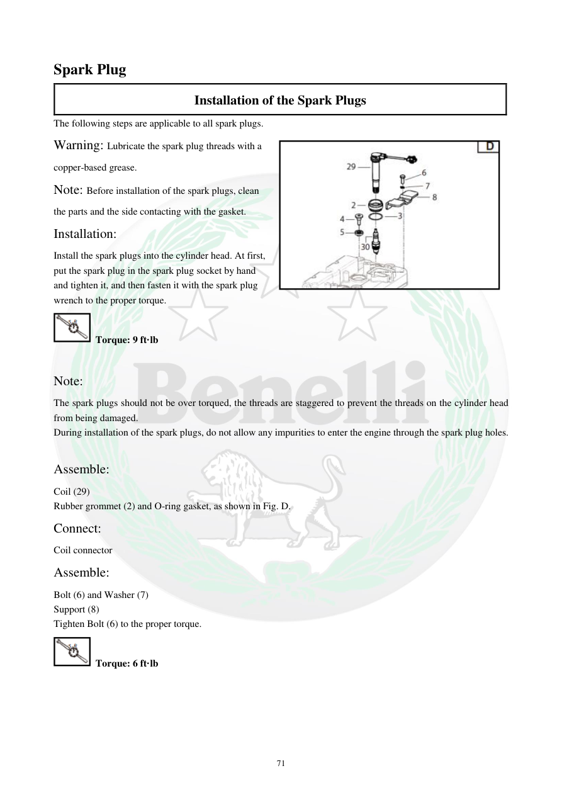

# Manual page 72

> Source: [page-0072.md](../source/page-0072.md)

## Page image / diagram

- [page-0072-img-01.png](../images/embedded/page-0072-img-01.png)

- [page-0072-img-02.jpeg](../images/embedded/page-0072-img-02.jpeg)

## Extracted text

# Source page 72

 
71 
Spark Plug 
Installation of the Spark Plugs 
The following steps are applicable to all spark plugs. 
Warning: Lubricate the spark plug threads with a 
copper-based grease.  
Note: Before installation of the spark plugs, clean 
the parts and the side contacting with the gasket. 
Installation: 
Install the spark plugs into the cylinder head. At first, 
put the spark plug in the spark plug socket by hand 
and tighten it, and then fasten it with the spark plug 
wrench to the proper torque. 
 Torque: 9 ft·lb  
        
Note: 
The spark plugs should not be over torqued, the threads are staggered to prevent the threads on the cylinder head 
from being damaged. 
During installation of the spark plugs, do not allow any impurities to enter the engine through the spark plug holes.  
 
Assemble: 
Coil (29) 
Rubber grommet (2) and O-ring gasket, as shown in Fig. D. 
Connect: 
Coil connector 
Assemble: 
Bolt (6) and Washer (7) 
Support (8) 
Tighten Bolt (6) to the proper torque. 
 Torque: 6 ft·lb

## Persian notes

### ترجمه و توضیح فارسی
**نصب شمع**

- رزوه شمع طبق دفترچه با **گریس پایه مس** روانکاری شود.
- قبل از نصب، محل نشستن واشر و اطراف آن را تمیز کنید.
- ابتدا شمع را داخل بکس شمع قرار داده و **با دست** رزوه کنید تا از درگیرشدن صحیح رزوه مطمئن شوید.
- سپس با آچار شمع تا گشتاور تعیین‌شده سفت کنید.

**گشتاور شمع:** **9 ft·lb**، حدود **12.2 N·m**.

از سفت‌کردن بیش از حد خودداری کنید، چون امکان آسیب به رزوه سرسیلندر وجود دارد.

سپس:
1. کویل **(29)** را نصب کنید.
2. لاستیک/بوش **(2)** و اورینگ را طبق شکل نصب کنید.
3. سوکت کویل را وصل کنید.
4. پیچ **(6)**، واشر **(7)** و پایه **(8)** را نصب کنید.

**گشتاور پیچ (6):** **6 ft·lb**، حدود **8.1 N·m**.

در تمام مراحل مراقب باشید آلودگی وارد سوراخ شمع نشود.
