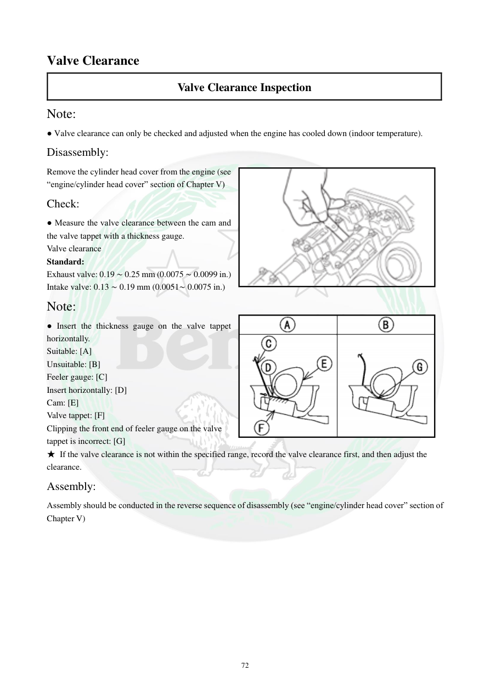

# Manual page 73

> Source: [page-0073.md](../source/page-0073.md)

## Page image / diagram

- [page-0073-img-01.png](../images/embedded/page-0073-img-01.png)

- [page-0073-img-02.png](../images/embedded/page-0073-img-02.png)

## Extracted text

# Source page 73

 
72 
Valve Clearance 
Valve Clearance Inspection 
Note: 
● Valve clearance can only be checked and adjusted when the engine has cooled down (indoor temperature). 
Disassembly: 
Remove the cylinder head cover from the engine (see 
“engine/cylinder head cover” section of Chapter V) 
Check: 
● Measure the valve clearance between the cam and 
the valve tappet with a thickness gauge. 
Valve clearance 
Standard: 
Exhaust valve: 0.19 ∼ 0.25 mm (0.0075 ∼ 0.0099 in.) 
Intake valve: 0.13 ∼ 0.19 mm (0.0051∼ 0.0075 in.) 
Note: 
● Insert the thickness gauge on the valve tappet 
horizontally. 
Suitable: [A] 
Unsuitable: [B]  
Feeler gauge: [C] 
Insert horizontally: [D] 
Cam: [E] 
Valve tappet: [F] 
Clipping the front end of feeler gauge on the valve 
tappet is incorrect: [G] 
★ If the valve clearance is not within the specified range, record the valve clearance first, and then adjust the 
clearance. 
Assembly: 
Assembly should be conducted in the reverse sequence of disassembly (see “engine/cylinder head cover” section of 
Chapter V)

## Persian notes

### ترجمه و توضیح فارسی
**بازرسی خلاصی سوپاپ**

این اندازه‌گیری فقط زمانی انجام شود که موتور **کاملاً سرد و در دمای محیط** باشد.

1. درپوش سرسیلندر را طبق بخش مربوط به Chapter V باز کنید.
2. فاصله بین **بادامک میل‌سوپاپ** و **تاپت/تپت سوپاپ** را با فیلر اندازه بگیرید.

**مقادیر استاندارد:**
- سوپاپ **هوا/ورودی (Intake): 0.13 تا 0.19 mm**
- سوپاپ **دود/خروجی (Exhaust): 0.19 تا 0.25 mm**

**نحوه قرار دادن فیلر بسیار مهم است:** فیلر باید به‌صورت **افقی** روی تاپت قرار بگیرد. شکل صفحه تفاوت حالت صحیح **[A]** و نادرست **[B]** را نشان می‌دهد.

اگر مقدار اندازه‌گیری‌شده خارج از محدوده استاندارد باشد، **ابتدا مقدار واقعی را ثبت کنید و بعد سراغ تنظیم بروید**.

**نکته پروژه:** این مقادیر مشخصات مستقیم دفترچه TNT300 هستند و برای TNT249 بدون تطبیق مدل نباید تغییر یا تعمیم داده شوند.
