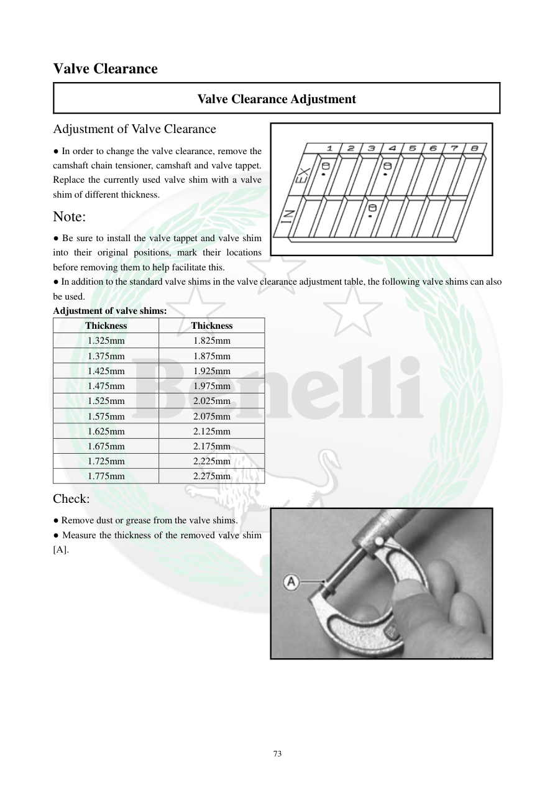

# Manual page 74

> Source: [page-0074.md](../source/page-0074.md)

## Page image / diagram

- [page-0074-img-01.png](../images/embedded/page-0074-img-01.png)

- [page-0074-img-02.jpeg](../images/embedded/page-0074-img-02.jpeg)

## Extracted text

# Source page 74

 
73 
Valve Clearance 
Valve Clearance Adjustment 
Adjustment of Valve Clearance 
● In order to change the valve clearance, remove the 
camshaft chain tensioner, camshaft and valve tappet. 
Replace the currently used valve shim with a valve 
shim of different thickness. 
Note: 
● Be sure to install the valve tappet and valve shim 
into their original positions, mark their locations 
before removing them to help facilitate this. 
● In addition to the standard valve shims in the valve clearance adjustment table, the following valve shims can also 
be used. 
Adjustment of valve shims: 
Thickness 
Thickness 
1.325mm 
1.825mm 
1.375mm 
1.875mm 
1.425mm 
1.925mm 
1.475mm 
1.975mm 
1.525mm 
2.025mm 
1.575mm 
2.075mm 
1.625mm 
2.125mm 
1.675mm 
2.175mm 
1.725mm 
2.225mm 
1.775mm 
2.275mm 
Check: 
● Remove dust or grease from the valve shims. 
● Measure the thickness of the removed valve shim 
[A].

## Persian notes

### ترجمه و توضیح فارسی
**تنظیم خلاصی سوپاپ با تعویض Shim**

برای تغییر خلاصی:
1. سفت‌کن/تنشنر زنجیر میل‌سوپاپ را باز کنید.
2. میل‌سوپاپ و تاپت را خارج کنید.
3. Shim فعلی را با Shim دارای ضخامت مناسب جایگزین کنید.

**نکته بسیار مهم:** قبل از باز کردن، محل هر تاپت و Shim را علامت‌گذاری کنید و آنها را در محل اصلی خود نگه دارید.

ضخامت‌های اضافی قابل استفاده که در این صفحه آمده‌اند:
**1.325، 1.375، 1.425، 1.475، 1.525، 1.575، 1.625، 1.675، 1.725، 1.775، 1.825، 1.875، 1.925، 1.975، 2.025، 2.075، 2.125، 2.175، 2.225 و 2.275 mm**

پس از خارج کردن Shim:
- گردوغبار و گریس را پاک کنید.
- ضخامت Shim خارج‌شده **[A]** را با ابزار مناسب اندازه بگیرید.

**نکته پروژه:** انتخاب Shim جدید باید از جدول تنظیم و بر اساس مقدار واقعی خلاصی و ضخامت Shim فعلی انجام شود، نه با حدس.
