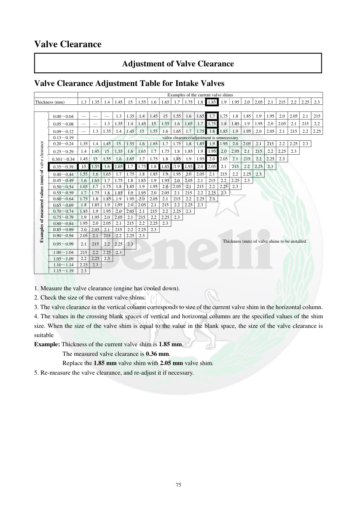

# Manual page 76

> Source: [page-0076.md](../source/page-0076.md)

## Page image / diagram

## Extracted text

# Source page 76

 
75 
Valve Clearance 
Adjustment of Valve Clearance 
Valve Clearance Adjustment Table for Intake Valves 
 
Examples of the current valve shims 
Thickness (mm) 
1.3 
1.35 
1.4 
1.45 
15 
1.55 
1.6 
1.65 
1.7 
1.75 
1.8 
1.85 
1.9 
1.95 
2.0 
2.05 
2.1 
215 
2.2 
2.25 
2.3 
 
Examples of measured values (mm) of valve clearance 
0.00～0.04 
— 
— 
— 
1.3 
1.35 
1.4 
1.45 
15 
1.55 
1.6 
1.65 
1.7 
1.75 
1.8 
1.85 
1.9 
1.95 
2.0 
2.05 
2.1 
215 
0.05～0.08 
— 
— 
1.3 
1.35 
1.4 
1.45 
15 
1.55 
1.6 
1.65 
1.7 
1.75 
1.8 
1.85 
1.9 
1.95 
2.0 
2.05 
2.1 
215 
2.2 
0.09～0.12 
— 
1.3 
1.35 
1.4 
1.45 
15 
1.55 
1.6 
1.65 
1.7 
1.75 
1.8 
1.85 
1.9 
1.95 
2.0 
2.05 
2.1 
215 
2.2 
2.25 
0.13～0.19 
valve clearance/adjustment is unnecessary 
0.20～0.24 
1.35 
1.4 
1.45 
15 
1.55 
1.6 
1.65 
1.7 
1.75 
1.8 
1.85 
1.9 
1.95 
2.0 
2.05 
2.1 
215 
2.2 
2.25 
2.3 
 
0.25～0.29 
1.4 
1.45 
15 
1.55 
1.6 
1.65 
1.7 
1.75 
1.8 
1.85 
1.9 
1.95 
2.0 
2.05 
2.1 
215 
2.2 
2.25 
2.3 
 
 
0.301～0.34 
1.45 
15 
1.55 
1.6 
1.65 
1.7 
1.75 
1.8 
1.85 
1.9 
1.95 
2.0 
2.05 
2.1 
215 
2.2 
2.25 
2.3 
 
 
 
0.35～0.39 
15 
1.55 
1.6 
1.65 
1.7 
1.75 
1.8 
1.85 
1.9 
1.95 
2.0 
2.05 
2.1 
215 
2.2 
2.25 
2.3 
 
 
 
 
0.40～0.44 
1.55 
1.6 
1.65 
1.7 
1.75 
1.8 
1.85 
1.9 
1.95 
2.0 
2.05 
2.1 
215 
2.2 
2.25 
2.3 
 
 
 
 
 
0.45～0.49 
1.6 
1.65 
1.7 
1.75 
1.8 
1.85 
1.9 
1.95 
2.0 
2.05 
2.1 
215 
2.2 
2.25 
2.3 
 
 
 
 
 
 
0.50～0.54 
1.65 
1.7 
1.75 
1.8 
1.85 
1.9 
1.95 
2.0 
2.05 
2.1 
215 
2.2 
2.25 
2.3 
 
 
 
 
 
 
 
0.55～0.59 
1.7 
1.75 
1.8 
1.85 
1.9 
1.95 
2.0 
2.05 
2.1 
215 
2.2 
2.25 
2.3 
 
 
 
 
 
 
 
 
0.60～0.64 
1.75 
1.8 
1.85 
1.9 
1.95 
2.0 
2.05 
2.1 
215 
2.2 
2.25 
2.3 
 
 
 
 
 
 
 
 
 
0.65～0.69 
1.8 
1.85 
1.9 
1.95 
2.0 
2.05 
2.1 
215 
2.2 
2.25 
2.3 
 
 
 
 
 
 
 
 
 
 
0.70～0.74 
1.85 
1.9 
1.95 
2.0 
2.05 
2.1 
215 
2.2 
2.25 
2.3 
 
 
 
 
 
 
 
 
 
 
 
0.75～0.79 
1.9 
1.95 
2.0 
2.05 
2.1 
215 
2.2 
2.25 
2.3 
 
 
 
 
 
 
 
 
 
 
 
 
0.80～0.84 
1.95 
2.0 
2.05 
2.1 
215 
2.2 
2.25 
2.3 
 
 
 
 
 
 
 
 
 
 
 
 
 
0.85～0.89 
2.0 
2.05 
2.1 
215 
2.2 
2.25 
2.3 
 
 
 
 
 
 
 
 
 
 
 
 
 
 
0.90～0.94 
2.05 
2.1 
215 
2.2 
2.25 
2.3 
 
 
 
 
 
 
 
 
 
 
 
 
 
 
 
0.95～0.99 
2.1 
215 
2.2 
2.25 
2.3 
 
 
 
 
 
 
Thickness (mm) of valve shims to be installed 
 
1.00～1.04 
215 
2.2 
2.25 
2.3 
 
 
 
 
 
 
 
 
 
 
 
 
 
 
 
 
 
1.05～1.09 
2.2 
2.25 
2.3 
 
 
 
 
 
 
 
 
1.10～1.14 
2.25 
2.3 
 
 
 
 
 
 
1.15～1.19 
2.3 
 
 
 
 
 
 
 
 
1. Measure the valve clearance (engine has cooled down). 
2. Check the size of the current valve shims. 
3. The valve clearance in the vertical column corresponds to size of the current valve shim in the horizontal column. 
4. The values in the crossing blank spaces of vertical and horizontal columns are the specified values of the shim 
size. When the size of the valve shim is equal to the value in the blank space, the size of the valve clearance is 
suitable  
Example: Thickness of the current valve shim is 1.85 mm.  
 The measured valve clearance is 0.36 mm. 
  
 Replace the 1.85 mm valve shim with 2.05 mm valve shim. 
5. Re-measure the valve clearance, and re-adjust it if necessary.

## Persian notes

<!-- Persian translation/explanation will be added here. -->
