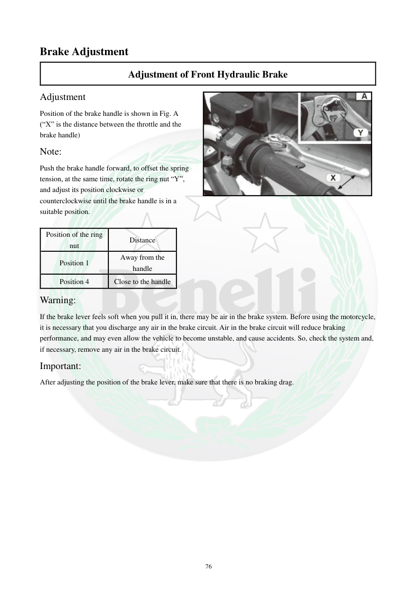

# Manual page 77

> Source: [page-0077.md](../source/page-0077.md)

## Page image / diagram

- [page-0077-img-01.jpeg](../images/embedded/page-0077-img-01.jpeg)

## Extracted text

# Source page 77

 
76 
Brake Adjustment  
Adjustment of Front Hydraulic Brake  
Adjustment 
Position of the brake handle is shown in Fig. A 
(“X” is the distance between the throttle and the 
brake handle) 
Note: 
Push the brake handle forward, to offset the spring 
tension, at the same time, rotate the ring nut “Y”, 
and adjust its position clockwise or 
counterclockwise until the brake handle is in a 
suitable position. 
 
Position of the ring 
nut 
Distance 
Position 1 
Away from the 
handle  
Position 4 
Close to the handle 
Warning: 
If the brake lever feels soft when you pull it in, there may be air in the brake system. Before using the motorcycle, 
it is necessary that you discharge any air in the brake circuit. Air in the brake circuit will reduce braking 
performance, and may even allow the vehicle to become unstable, and cause accidents. So, check the system and, 
if necessary, remove any air in the brake circuit. 
Important: 
After adjusting the position of the brake lever, make sure that there is no braking drag.

## Persian notes

<!-- Persian translation/explanation will be added here. -->
