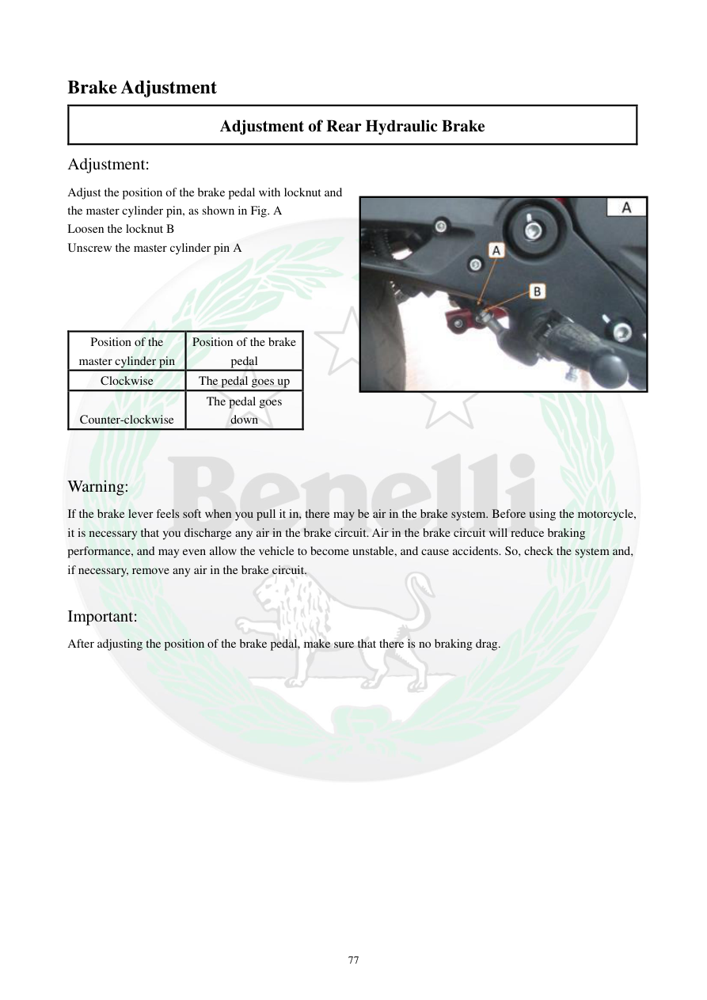

# Manual page 78

> Source: [page-0078.md](../source/page-0078.md)

## Page image / diagram

- [page-0078-img-01.jpeg](../images/embedded/page-0078-img-01.jpeg)

## Extracted text

# Source page 78

 
77 
Brake Adjustment 
Adjustment of Rear Hydraulic Brake 
Adjustment: 
Adjust the position of the brake pedal with locknut and 
the master cylinder pin, as shown in Fig. A 
Loosen the locknut B 
Unscrew the master cylinder pin A 
 
 
 
 
Position of the 
master cylinder pin 
Position of the brake 
pedal 
Clockwise 
The pedal goes up 
Counter-clockwise 
The pedal goes 
down 
 
 
Warning: 
If the brake lever feels soft when you pull it in, there may be air in the brake system. Before using the motorcycle, 
it is necessary that you discharge any air in the brake circuit. Air in the brake circuit will reduce braking 
performance, and may even allow the vehicle to become unstable, and cause accidents. So, check the system and, 
if necessary, remove any air in the brake circuit. 
 
Important: 
After adjusting the position of the brake pedal, make sure that there is no braking drag.

## Persian notes

### تنظیم ترمز هیدرولیک عقب
- موقعیت پدال ترمز عقب با مهره قفل **B** و پین سیلندر اصلی **A** تنظیم می‌شود.
- مهره قفل **B** را شل کنید، سپس پین **A** را تنظیم کنید.
- طبق جدول دفترچه: چرخاندن پین **در جهت عقربه‌های ساعت → پدال بالاتر**؛ چرخاندن **خلاف عقربه‌های ساعت → پدال پایین‌تر**.
- نرم بودن اهرم/پدال می‌تواند نشانه وجود هوا در مدار باشد و مدار باید بررسی و در صورت نیاز هواگیری شود.
- بعد از تنظیم، مطمئن شوید ترمز در حالت آزاد **گیر یا Drag** ندارد.

