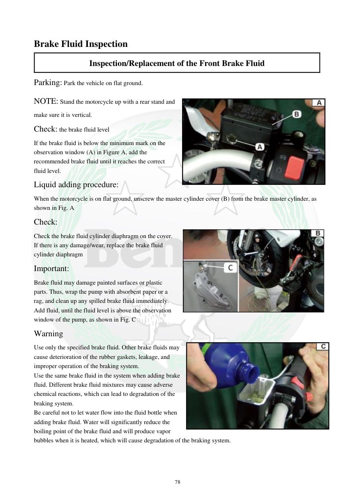

# Manual page 79

> Source: [page-0079.md](../source/page-0079.md)

## Page image / diagram

- [page-0079-img-01.jpeg](../images/embedded/page-0079-img-01.jpeg)

- [page-0079-img-02.jpeg](../images/embedded/page-0079-img-02.jpeg)

- [page-0079-img-03.jpeg](../images/embedded/page-0079-img-03.jpeg)

## Extracted text

# Source page 79

 
78 
Brake Fluid Inspection  
Inspection/Replacement of the Front Brake Fluid  
Parking: Park the vehicle on flat ground. 
NOTE: Stand the motorcycle up with a rear stand and 
make sure it is vertical. 
Check: the brake fluid level 
If the brake fluid is below the minimum mark on the 
observation window (A) in Figure A, add the 
recommended brake fluid until it reaches the correct 
fluid level. 
Liquid adding procedure: 
When the motorcycle is on flat ground, unscrew the master cylinder cover (B) from the brake master cylinder, as 
shown in Fig. A 
Check:  
Check the brake fluid cylinder diaphragm on the cover. 
If there is any damage/wear, replace the brake fluid 
cylinder diaphragm 
Important: 
Brake fluid may damage painted surfaces or plastic 
parts. Thus, wrap the pump with absorbent paper or a 
rag, and clean up any spilled brake fluid immediately. 
Add fluid, until the fluid level is above the observation 
window of the pump, as shown in Fig. C 
Warning 
Use only the specified brake fluid. Other brake fluids may 
cause deterioration of the rubber gaskets, leakage, and 
improper operation of the braking system. 
Use the same brake fluid in the system when adding brake 
fluid. Different brake fluid mixtures may cause adverse 
chemical reactions, which can lead to degradation of the 
braking system. 
Be careful not to let water flow into the fluid bottle when 
adding brake fluid. Water will significantly reduce the 
boiling point of the brake fluid and will produce vapor 
bubbles when it is heated, which will cause degradation of the braking system.

## Persian notes

### بررسی سطح روغن ترمز جلو
- موتور سیکلت را روی سطح صاف و کاملاً عمودی قرار دهید.
- سطح روغن را از پنجره مشاهده **A** بررسی کنید. اگر پایین‌تر از حداقل است، روغن ترمز توصیه‌شده را تا سطح صحیح اضافه کنید.
- برای افزودن روغن، درپوش سیلندر اصلی **B** را باز کنید.
- دیافراگم روی درپوش را از نظر آسیب و فرسودگی بررسی کنید.
- روغن ترمز می‌تواند به رنگ و قطعات پلاستیکی آسیب بزند؛ هرگونه ریختگی را فوراً پاک کنید.
- فقط از روغن ترمز مشخص‌شده استفاده کنید و روغن‌های متفاوت را با هم مخلوط نکنید.
- آب نباید وارد ظرف روغن ترمز شود، چون نقطه جوش را کاهش داده و می‌تواند باعث تشکیل حباب بخار شود.
- مشخصات دقیق سیال باید از بخش مشخصات دفترچه تطبیق داده شود و از حدس‌زدن نوع روغن خودداری شود.

