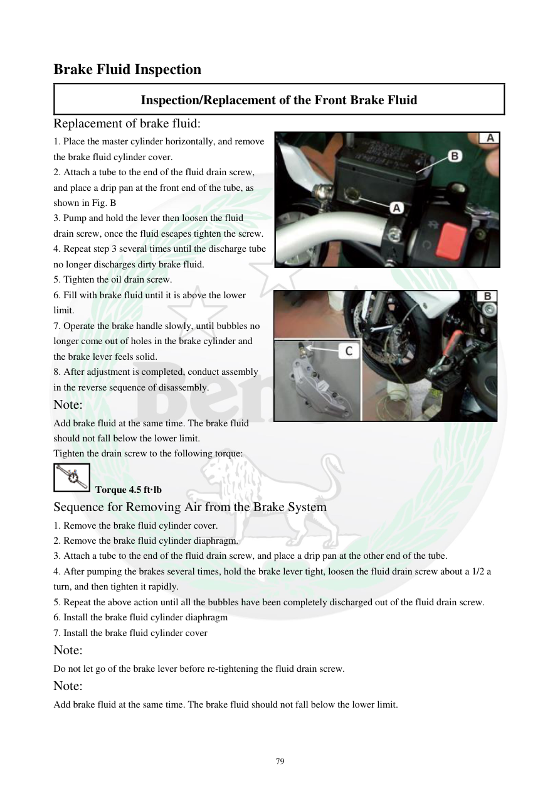

# Manual page 80

> Source: [page-0080.md](../source/page-0080.md)

## Page image / diagram

- [page-0080-img-03.jpeg](../images/embedded/page-0080-img-03.jpeg)

## Extracted text

# Source page 80

 
79 
Brake Fluid Inspection  
Inspection/Replacement of the Front Brake Fluid 
Replacement of brake fluid: 
1. Place the master cylinder horizontally, and remove 
the brake fluid cylinder cover. 
2. Attach a tube to the end of the fluid drain screw, 
and place a drip pan at the front end of the tube, as 
shown in Fig. B 
3. Pump and hold the lever then loosen the fluid 
drain screw, once the fluid escapes tighten the screw. 
4. Repeat step 3 several times until the discharge tube 
no longer discharges dirty brake fluid. 
5. Tighten the oil drain screw. 
6. Fill with brake fluid until it is above the lower 
limit. 
7. Operate the brake handle slowly, until bubbles no 
longer come out of holes in the brake cylinder and 
the brake lever feels solid. 
8. After adjustment is completed, conduct assembly 
in the reverse sequence of disassembly. 
Note: 
Add brake fluid at the same time. The brake fluid 
should not fall below the lower limit. 
Tighten the drain screw to the following torque: 
 Torque 4.5 ft·lb 
Sequence for Removing Air from the Brake System 
1. Remove the brake fluid cylinder cover. 
2. Remove the brake fluid cylinder diaphragm. 
3. Attach a tube to the end of the fluid drain screw, and place a drip pan at the other end of the tube. 
4. After pumping the brakes several times, hold the brake lever tight, loosen the fluid drain screw about a 1/2 a 
turn, and then tighten it rapidly. 
5. Repeat the above action until all the bubbles have been completely discharged out of the fluid drain screw. 
6. Install the brake fluid cylinder diaphragm 
7. Install the brake fluid cylinder cover 
Note: 
Do not let go of the brake lever before re-tightening the fluid drain screw. 
Note: 
Add brake fluid at the same time. The brake fluid should not fall below the lower limit.

## Persian notes

### تعویض و هواگیری روغن ترمز جلو
- سیلندر اصلی را افقی قرار دهید و درپوش را باز کنید.
- شیلنگ را به پیچ تخلیه وصل و ظرف جمع‌آوری آماده کنید.
- اهرم ترمز را چند بار پمپ کرده و نگه دارید؛ سپس پیچ تخلیه را باز کنید و پس از خروج سیال آن را دوباره ببندید.
- این کار را تا زمانی تکرار کنید که سیال کثیف از شیلنگ خارج نشود.
- روغن ترمز را اضافه کنید و اجازه ندهید سطح آن از حد پایین کمتر شود.
- اهرم را آرام حرکت دهید تا حباب‌ها خارج شوند و اهرم حالت سفت و پایدار پیدا کند.
- گشتاور پیچ تخلیه طبق این صفحه: **4.5 ft·lb**.
- برای هواگیری، پس از چند بار پمپ کردن، اهرم را نگه دارید، پیچ تخلیه را حدود **نیم دور** باز کنید و سریع دوباره ببندید. این روند تا خروج حباب‌ها تکرار می‌شود.
- **قبل از رها کردن اهرم، پیچ تخلیه باید دوباره سفت شده باشد.**
- پس از پایان، دیافراگم و درپوش را نصب کنید.
- مقادیر این صفحه مربوط به دفترچه TNT300 هستند و برای TNT249 نباید بدون تطبیق مستقیم تعمیم داده شوند.

