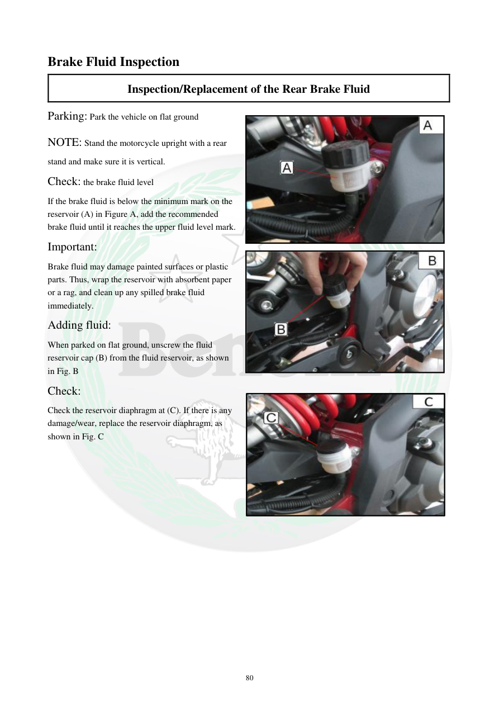

# Manual page 81

> Source: [page-0081.md](../source/page-0081.md)

## Page image / diagram

- [page-0081-img-01.jpeg](../images/embedded/page-0081-img-01.jpeg)

- [page-0081-img-02.jpeg](../images/embedded/page-0081-img-02.jpeg)

- [page-0081-img-03.jpeg](../images/embedded/page-0081-img-03.jpeg)

## Extracted text

# Source page 81

 
80 
Brake Fluid Inspection  
Inspection/Replacement of the Rear Brake Fluid 
Parking: Park the vehicle on flat ground 
NOTE: Stand the motorcycle upright with a rear 
stand and make sure it is vertical. 
Check: the brake fluid level 
If the brake fluid is below the minimum mark on the 
reservoir (A) in Figure A, add the recommended 
brake fluid until it reaches the upper fluid level mark. 
Important: 
Brake fluid may damage painted surfaces or plastic 
parts. Thus, wrap the reservoir with absorbent paper 
or a rag, and clean up any spilled brake fluid 
immediately. 
Adding fluid: 
When parked on flat ground, unscrew the fluid 
reservoir cap (B) from the fluid reservoir, as shown 
in Fig. B 
Check: 
Check the reservoir diaphragm at (C). If there is any 
damage/wear, replace the reservoir diaphragm, as 
shown in Fig. C

## Persian notes

<!-- Persian translation/explanation will be added here. -->
