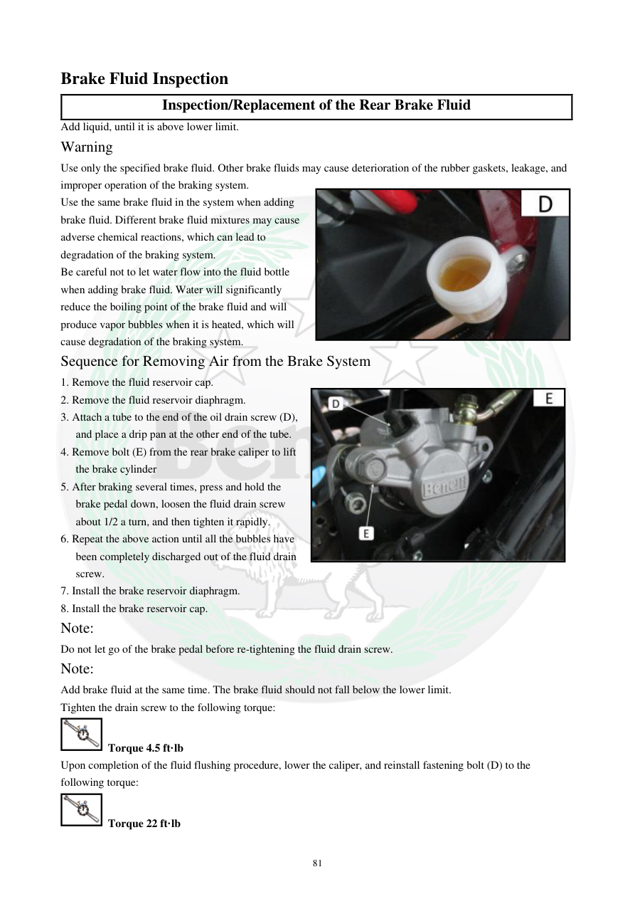

# Manual page 82

> Source: [page-0082.md](../source/page-0082.md)

## Page image / diagram

- [page-0082-img-02.jpeg](../images/embedded/page-0082-img-02.jpeg)

- [page-0082-img-03.jpeg](../images/embedded/page-0082-img-03.jpeg)

## Extracted text

# Source page 82

 
81 
Brake Fluid Inspection  
Inspection/Replacement of the Rear Brake Fluid 
Add liquid, until it is above lower limit. 
Warning 
Use only the specified brake fluid. Other brake fluids may cause deterioration of the rubber gaskets, leakage, and 
improper operation of the braking system. 
Use the same brake fluid in the system when adding 
brake fluid. Different brake fluid mixtures may cause 
adverse chemical reactions, which can lead to 
degradation of the braking system. 
Be careful not to let water flow into the fluid bottle 
when adding brake fluid. Water will significantly 
reduce the boiling point of the brake fluid and will 
produce vapor bubbles when it is heated, which will 
cause degradation of the braking system. 
Sequence for Removing Air from the Brake System 
1. Remove the fluid reservoir cap. 
2. Remove the fluid reservoir diaphragm. 
3. Attach a tube to the end of the oil drain screw (D), 
and place a drip pan at the other end of the tube. 
4. Remove bolt (E) from the rear brake caliper to lift 
the brake cylinder 
5. After braking several times, press and hold the 
brake pedal down, loosen the fluid drain screw 
about 1/2 a turn, and then tighten it rapidly. 
6. Repeat the above action until all the bubbles have 
been completely discharged out of the fluid drain 
screw. 
7. Install the brake reservoir diaphragm. 
8. Install the brake reservoir cap. 
Note: 
Do not let go of the brake pedal before re-tightening the fluid drain screw. 
Note: 
Add brake fluid at the same time. The brake fluid should not fall below the lower limit. 
Tighten the drain screw to the following torque: 
 Torque 4.5 ft·lb 
Upon completion of the fluid flushing procedure, lower the caliper, and reinstall fastening bolt (D) to the 
following torque: 
 Torque 22 ft·lb

## Persian notes

### تکمیل هواگیری و تعویض روغن ترمز عقب
- سطح روغن باید بالاتر از حد پایین (**Lower limit**) باقی بماند.
- فقط از روغن ترمز مشخص‌شده در دفترچه استفاده کنید و هنگام افزودن، روغن متفاوت را با روغن موجود مخلوط نکنید.
- ورود آب به بطری روغن ترمز ممنوع است؛ آب نقطه جوش روغن را کاهش می‌دهد و می‌تواند باعث تشکیل حباب بخار و افت عملکرد سیستم شود.
- دفترچه برای هواگیری عقب، اتصال شیلنگ به پیچ تخلیه **D** و جمع‌آوری سیال را توضیح می‌دهد. در مرحله هواگیری، پدال ترمز نگه داشته می‌شود، پیچ تخلیه حدود نیم دور باز و سپس سریع بسته می‌شود و این چرخه تا خروج حباب‌ها تکرار می‌شود.
- **قبل از رها کردن پدال، پیچ تخلیه باید دوباره سفت شده باشد.**
- گشتاور پیچ تخلیه: **4.5 ft·lb**.
- پس از پایان هواگیری، کالیپر به وضعیت خود برگردانده می‌شود و پیچ اتصال طبق مقدار دفترچه بسته می‌شود: **22 ft·lb**.
- مشخصات سیال و گشتاورها به‌عنوان مقادیر دفترچه TNT300 ثبت شده‌اند و برای TNT249 نباید بدون تطبیق مستقیم تعمیم داده شوند.

