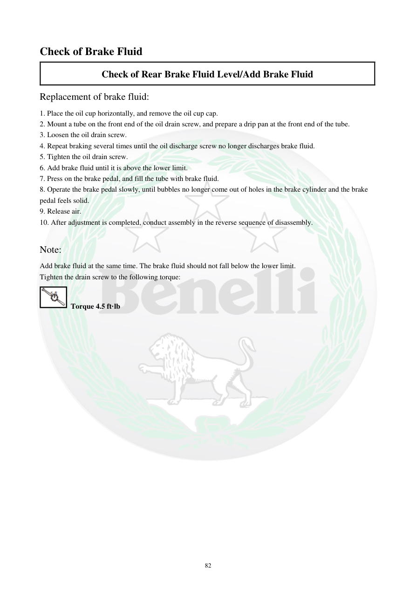

# Manual page 83

> Source: [page-0083.md](../source/page-0083.md)

## Page image / diagram

## Extracted text

# Source page 83

 
82 
Check of Brake Fluid 
Check of Rear Brake Fluid Level/Add Brake Fluid 
Replacement of brake fluid: 
1. Place the oil cup horizontally, and remove the oil cup cap. 
2. Mount a tube on the front end of the oil drain screw, and prepare a drip pan at the front end of the tube. 
3. Loosen the oil drain screw. 
4. Repeat braking several times until the oil discharge screw no longer discharges brake fluid. 
5. Tighten the oil drain screw. 
6. Add brake fluid until it is above the lower limit. 
7. Press on the brake pedal, and fill the tube with brake fluid. 
8. Operate the brake pedal slowly, until bubbles no longer come out of holes in the brake cylinder and the brake 
pedal feels solid. 
9. Release air. 
10. After adjustment is completed, conduct assembly in the reverse sequence of disassembly. 
 
Note: 
Add brake fluid at the same time. The brake fluid should not fall below the lower limit. 
Tighten the drain screw to the following torque: 
 Torque 4.5 ft·lb

## Persian notes

### تعویض و پر کردن روغن ترمز عقب
- مخزن/کاسه روغن را افقی قرار دهید و درپوش آن را باز کنید.
- شیلنگ را به قسمت جلویی پیچ تخلیه وصل و ظرف جمع‌آوری آماده کنید.
- پیچ تخلیه را باز کنید و با چند بار فشردن ترمز، تخلیه را ادامه دهید تا دیگر روغن از پیچ خارج نشود.
- پیچ تخلیه را ببندید و روغن ترمز را تا بالاتر از حد پایین اضافه کنید.
- پدال ترمز را فشار دهید و عملیات پر کردن/هواگیری را آرام انجام دهید تا حباب‌ها خارج شوند و پدال حالت سفت و پایدار پیدا کند.
- پس از اتمام، مونتاژ را برعکس ترتیب بازکردن انجام دهید.
- سطح روغن نباید از حد پایین کمتر شود.
- گشتاور پیچ تخلیه: **4.5 ft·lb**.
- **مقادیر این صفحه مربوط به دفترچه TNT300 هستند و برای TNT249 باید با مشخصات همان مدل تطبیق داده شوند.**

