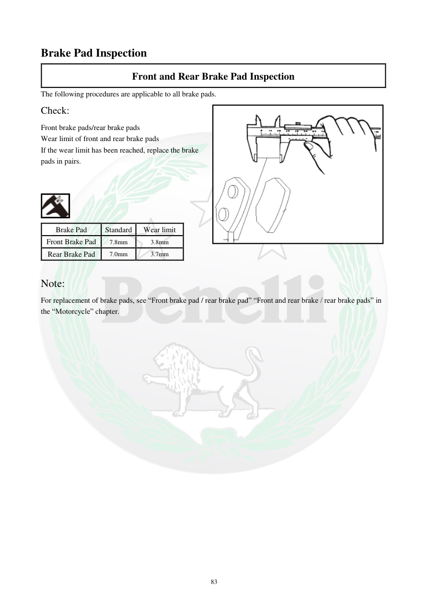

# Manual page 84

> Source: [page-0084.md](../source/page-0084.md)

## Page image / diagram

- [page-0084-img-01.png](../images/embedded/page-0084-img-01.png)

- [page-0084-img-02.png](../images/embedded/page-0084-img-02.png)

## Extracted text

# Source page 84

 
83 
Brake Pad Inspection 
Front and Rear Brake Pad Inspection  
The following procedures are applicable to all brake pads.  
Check:  
Front brake pads/rear brake pads 
Wear limit of front and rear brake pads 
If the wear limit has been reached, replace the brake 
pads in pairs.  
 
 
 
Brake Pad  
Standard 
Wear limit  
Front Brake Pad  
7.8mm 
3.8mm 
Rear Brake Pad 
7.0mm 
3.7mm 
 
Note: 
For replacement of brake pads, see “Front brake pad / rear brake pad” “Front and rear brake / rear brake pads” in 
the “Motorcycle” chapter.

## Persian notes

### بررسی لنت‌های ترمز جلو و عقب
این روش برای لنت‌های جلو و عقب کاربرد دارد.

- ضخامت لنت‌ها را با مقدار حد فرسودگی مقایسه کنید.
- اگر لنت به حد فرسودگی رسیده باشد، طبق دفترچه **لنت‌ها را به‌صورت جفت تعویض کنید**.

| مورد | ضخامت استاندارد | حد فرسودگی |
|---|---:|---:|
| لنت جلو | 7.8 mm | 3.8 mm |
| لنت عقب | 7.0 mm | 3.7 mm |

- برای روش تعویض، دفترچه به بخش مربوط به ترمز در فصل چهارم ارجاع می‌دهد.
- این اعداد به‌عنوان داده دفترچه TNT300 ثبت شده‌اند و نباید بدون تطبیق برای TNT249 استفاده شوند.

