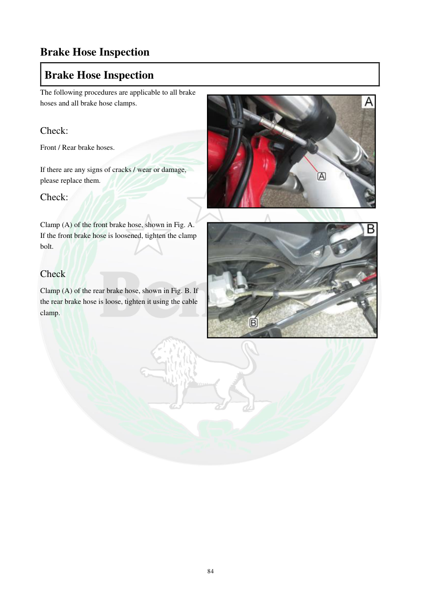

# Manual page 85

> Source: [page-0085.md](../source/page-0085.md)

## Page image / diagram

- [page-0085-img-01.jpeg](../images/embedded/page-0085-img-01.jpeg)

- [page-0085-img-02.jpeg](../images/embedded/page-0085-img-02.jpeg)

## Extracted text

# Source page 85

 
84 
Brake Hose Inspection 
Brake Hose Inspection 
The following procedures are applicable to all brake 
hoses and all brake hose clamps.  
 
Check:  
Front / Rear brake hoses. 
 
If there are any signs of cracks / wear or damage, 
please replace them.  
Check:  
 
Clamp (A) of the front brake hose, shown in Fig. A. 
If the front brake hose is loosened, tighten the clamp 
bolt.  
 
Check  
Clamp (A) of the rear brake hose, shown in Fig. B. If 
the rear brake hose is loose, tighten it using the cable 
clamp.

## Persian notes

### بررسی شیلنگ‌های ترمز
- تمام شیلنگ‌ها و بست‌های سیستم ترمز جلو و عقب را از نظر **ترک، ساییدگی و آسیب** بررسی کنید.
- در صورت مشاهده ترک، فرسودگی یا آسیب، شیلنگ طبق دفترچه باید تعویض شود.
- بست شیلنگ ترمز جلو در محل **A** را بررسی کنید؛ اگر شیلنگ شل است، پیچ بست را سفت کنید.
- بست شیلنگ ترمز عقب در محل **A** را بررسی کنید؛ اگر شل است، آن را با بست/گیره مربوطه محکم کنید.
- تصویر همین صفحه برای تشخیص محل بست‌ها مرجع اصلی است.

