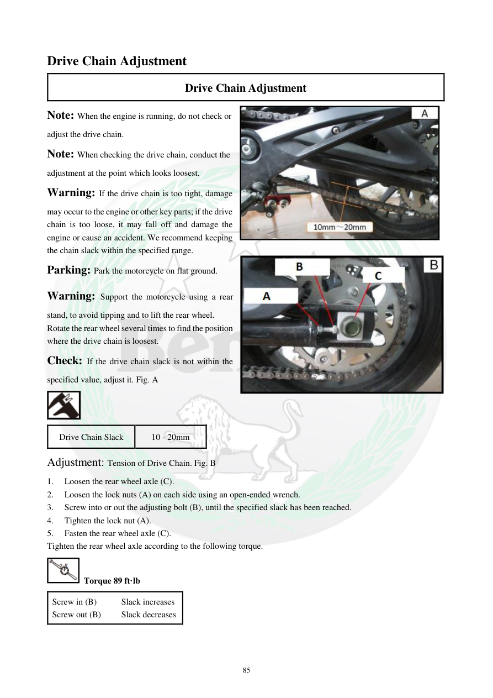

# Manual page 86

> Source: [page-0086.md](../source/page-0086.md)

## Page image / diagram

- [page-0086-img-03.jpeg](../images/embedded/page-0086-img-03.jpeg)

- [page-0086-img-04.jpeg](../images/embedded/page-0086-img-04.jpeg)

## Extracted text

# Source page 86

 
85 
Drive Chain Adjustment 
Drive Chain Adjustment 
Note: When the engine is running, do not check or 
adjust the drive chain.  
Note: When checking the drive chain, conduct the 
adjustment at the point which looks loosest.  
Warning: If the drive chain is too tight, damage 
may occur to the engine or other key parts; if the drive 
chain is too loose, it may fall off and damage the 
engine or cause an accident. We recommend keeping 
the chain slack within the specified range. 
Parking: Park the motorcycle on flat ground.  
Warning: Support the motorcycle using a rear 
stand, to avoid tipping and to lift the rear wheel. 
Rotate the rear wheel several times to find the position 
where the drive chain is loosest. 
Check: If the drive chain slack is not within the 
specified value, adjust it. Fig. A 
 
Drive Chain Slack 
10 - 20mm 
Adjustment: Tension of Drive Chain. Fig. B 
1. 
Loosen the rear wheel axle (C).  
2. 
Loosen the lock nuts (A) on each side using an open-ended wrench.  
3. 
Screw into or out the adjusting bolt (B), until the specified slack has been reached.   
4. 
Tighten the lock nut (A).  
5. 
Fasten the rear wheel axle (C).  
Tighten the rear wheel axle according to the following torque.  
 Torque 89 ft·lb 
Screw in (B) 
   Slack increases  
Screw out (B)    Slack decreases

## Persian notes

### تنظیم زنجیر انتقال نیرو
- هنگام روشن بودن موتور، زنجیر را بررسی یا تنظیم نکنید.
- چرخ عقب را چند دور بچرخانید و **شل‌ترین نقطه زنجیر** را پیدا کنید؛ اندازه‌گیری و تنظیم باید در همان نقطه انجام شود.
- موتور سیکلت روی سطح صاف قرار گیرد و برای بلند کردن چرخ عقب از جک/پایه عقب استفاده شود.
- لقی استاندارد زنجیر طبق این صفحه: **10 تا 20 mm**.
- ترتیب کلی تنظیم طبق دفترچه: محور چرخ عقب **C** را شل کنید، مهره‌های قفل‌کننده **A** را باز کنید، پیچ تنظیم **B** را تنظیم کنید تا لقی به محدوده مشخص برسد، سپس مهره قفل و محور چرخ را سفت کنید.
- گشتاور محور چرخ عقب: **89 ft·lb**.
- جهت تنظیم طبق متن صفحه: **پیچ B به داخل → افزایش لقی**، **پیچ B به بیرون → کاهش لقی**.
- مقدار و جهت تنظیم از متن دفترچه حفظ شده و در صورت تعارض با تصویر، تصویر صفحه مرجع نهایی پروژه خواهد بود.

