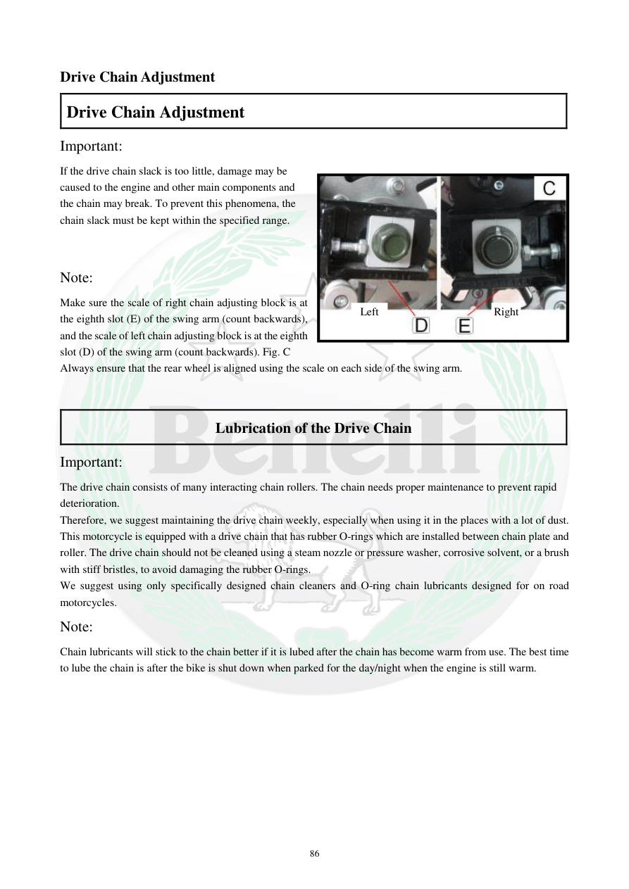

# Manual page 87

> Source: [page-0087.md](../source/page-0087.md)

## Page image / diagram

- [page-0087-img-01.jpeg](../images/embedded/page-0087-img-01.jpeg)

- [page-0087-img-02.png](../images/embedded/page-0087-img-02.png)

- [page-0087-img-03.png](../images/embedded/page-0087-img-03.png)

## Extracted text

# Source page 87

 
86 
Drive Chain Adjustment 
Drive Chain Adjustment 
Important:  
If the drive chain slack is too little, damage may be 
caused to the engine and other main components and 
the chain may break. To prevent this phenomena, the 
chain slack must be kept within the specified range.  
 
Note:  
Make sure the scale of right chain adjusting block is at 
the eighth slot (E) of the swing arm (count backwards), 
and the scale of left chain adjusting block is at the eighth 
slot (D) of the swing arm (count backwards). Fig. C 
Always ensure that the rear wheel is aligned using the scale on each side of the swing arm. 
 
 
Lubrication of the Drive Chain  
Important:  
The drive chain consists of many interacting chain rollers. The chain needs proper maintenance to prevent rapid 
deterioration. 
Therefore, we suggest maintaining the drive chain weekly, especially when using it in the places with a lot of dust. 
This motorcycle is equipped with a drive chain that has rubber O-rings which are installed between chain plate and 
roller. The drive chain should not be cleaned using a steam nozzle or pressure washer, corrosive solvent, or a brush 
with stiff bristles, to avoid damaging the rubber O-rings. 
We suggest using only specifically designed chain cleaners and O-ring chain lubricants designed for on road 
motorcycles.  
Note:  
Chain lubricants will stick to the chain better if it is lubed after the chain has become warm from use. The best time 
to lube the chain is after the bike is shut down when parked for the day/night when the engine is still warm.  
 
 
 
Right 
Left

## Persian notes

### هم‌راستایی چرخ عقب و روانکاری زنجیر
- پس از تنظیم زنجیر، هم‌راستایی چرخ عقب را با مقیاس دو طرف بازوی عقب بررسی کنید. دفترچه برای بلوک تنظیم سمت راست و چپ به **شیار هشتم** اشاره می‌کند.
- لقی زنجیر باید در محدوده مشخص دفترچه باقی بماند؛ لقی کم می‌تواند به موتور و اجزای اصلی آسیب بزند و لقی زیاد می‌تواند باعث خارج شدن زنجیر شود.
- زنجیر این موتور دارای **O-ring لاستیکی** بین صفحات و رولرهاست.
- برای جلوگیری از آسیب به O-ringها، از بخار یا واترجت پرفشار، حلال خورنده و برس با موهای سخت استفاده نکنید.
- دفترچه استفاده از شوینده مخصوص زنجیر و روان‌کننده مخصوص زنجیرهای O-ringدار را توصیه می‌کند.
- روانکاری زمانی بهتر انجام می‌شود که زنجیر پس از کارکرد گرم شده باشد.
- نگهداری منظم، به‌خصوص در محیط‌های پرگردوغبار، اهمیت بیشتری دارد.

