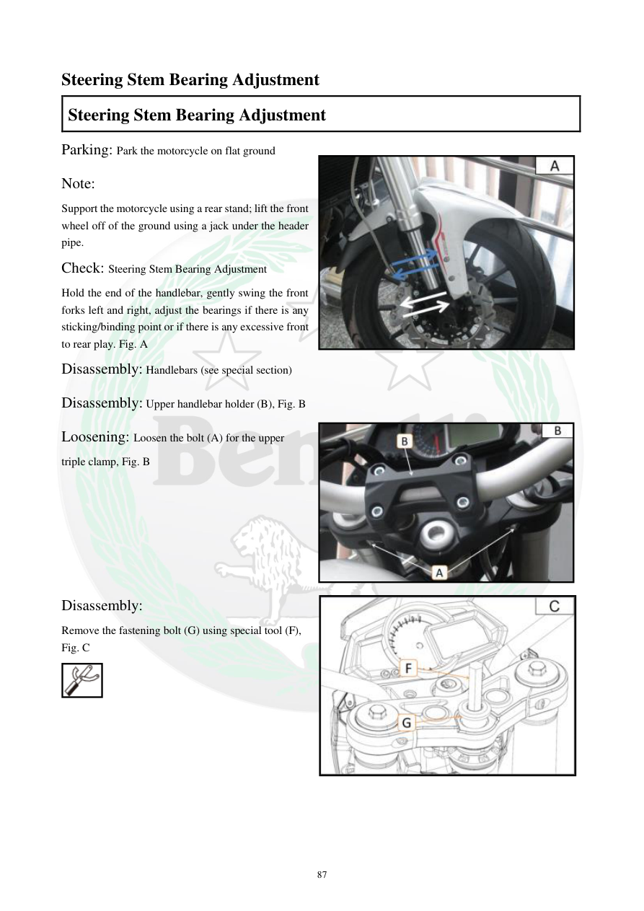

# Manual page 88

> Source: [page-0088.md](../source/page-0088.md)

## Page image / diagram

- [page-0088-img-01.png](../images/embedded/page-0088-img-01.png)

- [page-0088-img-02.jpeg](../images/embedded/page-0088-img-02.jpeg)

- [page-0088-img-03.jpeg](../images/embedded/page-0088-img-03.jpeg)

- [page-0088-img-04.jpeg](../images/embedded/page-0088-img-04.jpeg)

## Extracted text

# Source page 88

 
87 
Steering Stem Bearing Adjustment 
Steering Stem Bearing Adjustment 
Parking: Park the motorcycle on flat ground 
Note:  
Support the motorcycle using a rear stand; lift the front 
wheel off of the ground using a jack under the header 
pipe.  
Check: Steering Stem Bearing Adjustment 
Hold the end of the handlebar, gently swing the front 
forks left and right, adjust the bearings if there is any 
sticking/binding point or if there is any excessive front 
to rear play. Fig. A 
Disassembly: Handlebars (see special section) 
Disassembly: Upper handlebar holder (B), Fig. B 
Loosening: Loosen the bolt (A) for the upper 
triple clamp, Fig. B   
 
 
 
 
 
 
 
Disassembly: 
Remove the fastening bolt (G) using special tool (F), 
Fig. C

## Persian notes

### بررسی لقی بلبرینگ‌های فرمان
- موتور سیکلت روی سطح صاف قرار گیرد و با پایه عقب مهار شود؛ چرخ جلو باید از زمین بلند شود.
- با گرفتن انتهای فرمان، دوشاخ جلو را آرام به چپ و راست حرکت دهید.
- اگر نقطه گیر/سفتی یا لقی بیش از حد جلو و عقب وجود دارد، بلبرینگ‌های فرمان نیاز به بررسی و تنظیم دارند.
- برای ادامه عملیات، دفترچه به باز کردن فرمان و نگهدارنده بالایی فرمان و سپس شل کردن پیچ **A** روی تریپل‌کلمپ بالایی اشاره می‌کند.
- پیچ اتصال **G** با ابزار مخصوص **F** باز می‌شود.
- تصویر صفحه برای شناسایی قطعات و ترتیب دسترسی مهم است.

