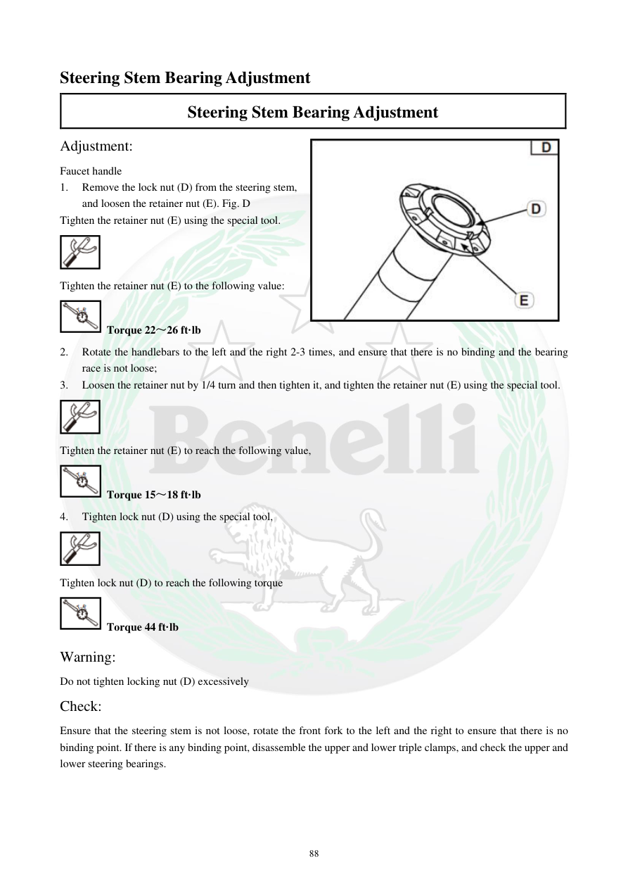

# Manual page 89

> Source: [page-0089.md](../source/page-0089.md)

## Page image / diagram

- [page-0089-img-02.png](../images/embedded/page-0089-img-02.png)

- [page-0089-img-03.jpeg](../images/embedded/page-0089-img-03.jpeg)

## Extracted text

# Source page 89

 
88 
Steering Stem Bearing Adjustment 
Steering Stem Bearing Adjustment 
Adjustment:  
Faucet handle 
1. 
Remove the lock nut (D) from the steering stem, 
and loosen the retainer nut (E). Fig. D 
Tighten the retainer nut (E) using the special tool. 
 
Tighten the retainer nut (E) to the following value:  
 Torque 22～26 ft·lb 
2. 
Rotate the handlebars to the left and the right 2-3 times, and ensure that there is no binding and the bearing 
race is not loose;  
3. 
Loosen the retainer nut by 1/4 turn and then tighten it, and tighten the retainer nut (E) using the special tool. 
 
Tighten the retainer nut (E) to reach the following value,  
 Torque 15～18 ft·lb 
4. 
Tighten lock nut (D) using the special tool,  
 
Tighten lock nut (D) to reach the following torque  
 Torque 44 ft·lb 
Warning:  
Do not tighten locking nut (D) excessively 
Check:  
Ensure that the steering stem is not loose, rotate the front fork to the left and the right to ensure that there is no 
binding point. If there is any binding point, disassemble the upper and lower triple clamps, and check the upper and 
lower steering bearings.

## Persian notes

<!-- Persian translation/explanation will be added here. -->
