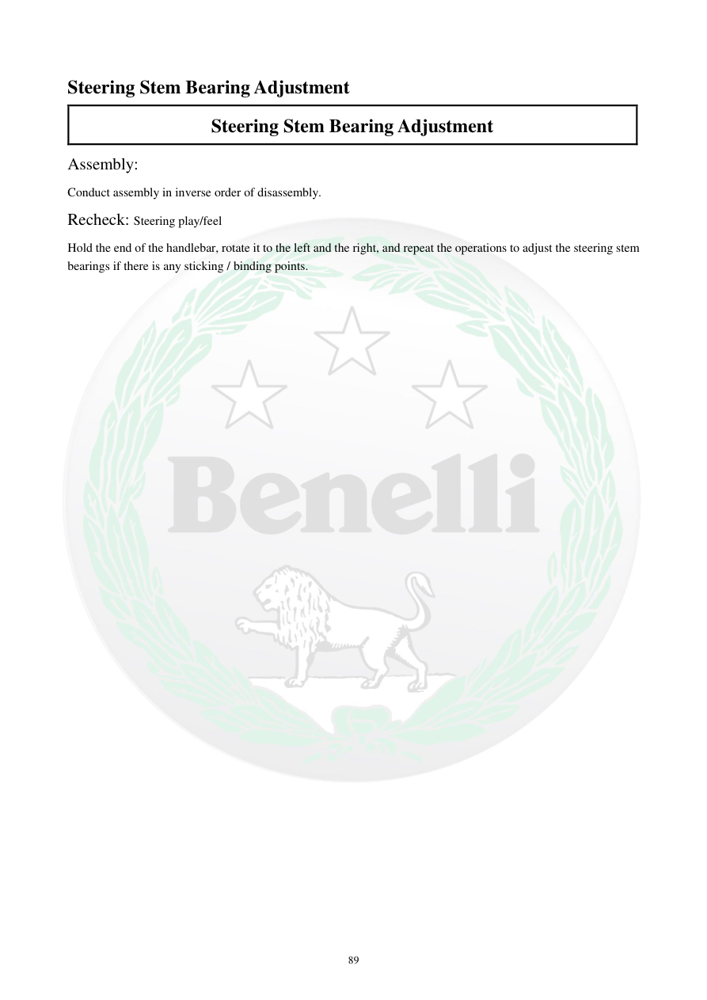

# Manual page 90

> Source: [page-0090.md](../source/page-0090.md)

## Page image / diagram

## Extracted text

# Source page 90

 
89 
Steering Stem Bearing Adjustment 
Steering Stem Bearing Adjustment 
Assembly:  
Conduct assembly in inverse order of disassembly.  
Recheck: Steering play/feel  
Hold the end of the handlebar, rotate it to the left and the right, and repeat the operations to adjust the steering stem 
bearings if there is any sticking / binding points.

## Persian notes

<!-- Persian translation/explanation will be added here. -->
