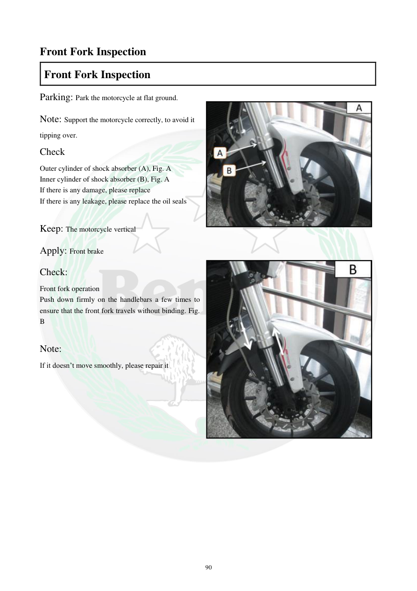

# Manual page 91

> Source: [page-0091.md](../source/page-0091.md)

## Page image / diagram

- [page-0091-img-01.jpeg](../images/embedded/page-0091-img-01.jpeg)

- [page-0091-img-02.jpeg](../images/embedded/page-0091-img-02.jpeg)

## Extracted text

# Source page 91

 
90 
Front Fork Inspection  
Front Fork Inspection   
Parking: Park the motorcycle at flat ground. 
Note: Support the motorcycle correctly, to avoid it 
tipping over.  
Check  
Outer cylinder of shock absorber (A), Fig. A 
Inner cylinder of shock absorber (B), Fig. A 
If there is any damage, please replace 
If there is any leakage, please replace the oil seals 
 
Keep: The motorcycle vertical  
Apply: Front brake  
Check:  
Front fork operation 
Push down firmly on the handlebars a few times to 
ensure that the front fork travels without binding. Fig. 
B 
 
Note: 
If it doesn’t move smoothly, please repair it

## Persian notes

<!-- Persian translation/explanation will be added here. -->
