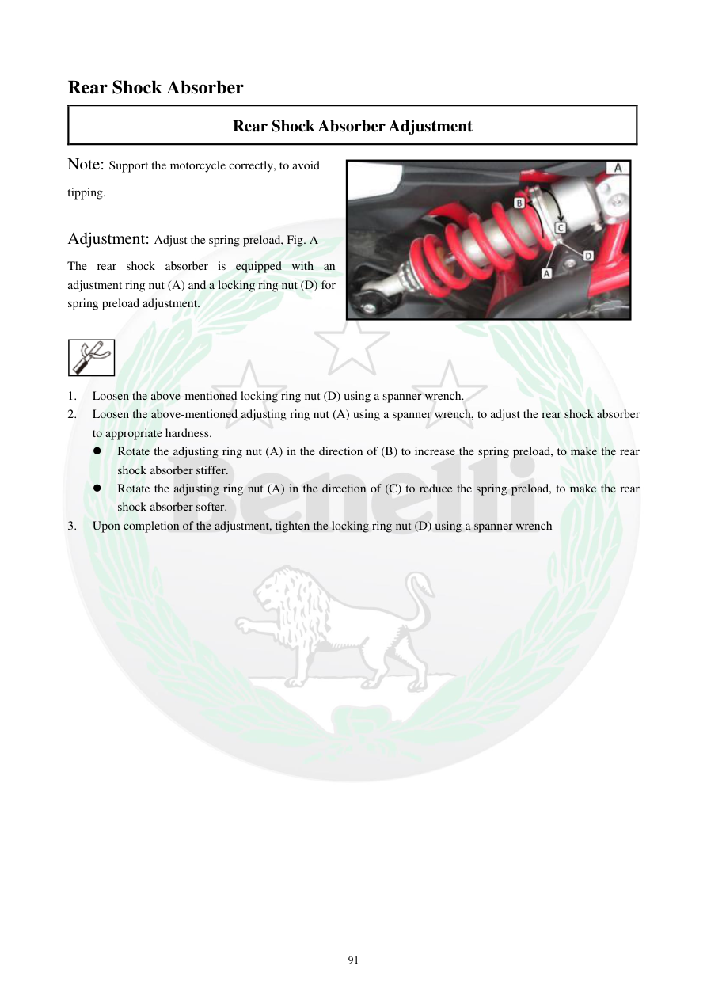

# Manual page 92

> Source: [page-0092.md](../source/page-0092.md)

## Page image / diagram

- [page-0092-img-01.png](../images/embedded/page-0092-img-01.png)

- [page-0092-img-02.jpeg](../images/embedded/page-0092-img-02.jpeg)

## Extracted text

# Source page 92

 
91 
Rear Shock Absorber  
Rear Shock Absorber Adjustment 
Note: Support the motorcycle correctly, to avoid 
tipping.  
 
Adjustment: Adjust the spring preload, Fig. A  
The rear shock absorber is equipped with an 
adjustment ring nut (A) and a locking ring nut (D) for 
spring preload adjustment. 
 
 
1. 
Loosen the above-mentioned locking ring nut (D) using a spanner wrench.  
2. 
Loosen the above-mentioned adjusting ring nut (A) using a spanner wrench, to adjust the rear shock absorber 
to appropriate hardness.  
 
Rotate the adjusting ring nut (A) in the direction of (B) to increase the spring preload, to make the rear 
shock absorber stiffer. 
 
Rotate the adjusting ring nut (A) in the direction of (C) to reduce the spring preload, to make the rear 
shock absorber softer. 
3. 
Upon completion of the adjustment, tighten the locking ring nut (D) using a spanner wrench

## Persian notes

### تنظیم پیش‌بار فنر کمک عقب
- موتور سیکلت را به‌درستی مهار کنید تا خطر واژگونی وجود نداشته باشد.
- کمک عقب دارای **مهره تنظیم A** و **مهره قفل D** برای تنظیم پیش‌بار فنر است.
- ابتدا مهره قفل **D** را با آچار مخصوص شل کنید.
- سپس مهره تنظیم **A** را بچرخانید تا سختی مناسب کمک به دست آید.
- جهت **B**: پیش‌بار فنر بیشتر و کمک سفت‌تر می‌شود.
- جهت **C**: پیش‌بار کمتر و کمک نرم‌تر می‌شود.
- پس از تنظیم، مهره قفل **D** را دوباره محکم کنید.
- جهت‌های B و C را با تصویر همان صفحه تطبیق دهید؛ متن OCR ممکن است جهت فلش‌ها را ناقص منتقل کرده باشد.

