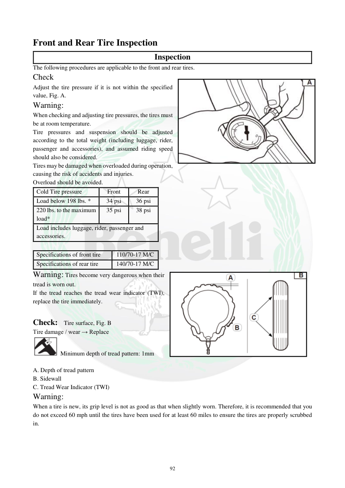

# Manual page 93

> Source: [page-0093.md](../source/page-0093.md)

## Page image / diagram

- [page-0093-img-01.png](../images/embedded/page-0093-img-01.png)

- [page-0093-img-02.jpeg](../images/embedded/page-0093-img-02.jpeg)

## Extracted text

# Source page 93

 
92 
Front and Rear Tire Inspection  
Inspection  
The following procedures are applicable to the front and rear tires. 
Check  
Adjust the tire pressure if it is not within the specified 
value, Fig. A. 
Warning:  
When checking and adjusting tire pressures, the tires must 
be at room temperature. 
Tire pressures and suspension should be adjusted 
according to the total weight (including luggage, rider, 
passenger and accessories), and assumed riding speed 
should also be considered.  
Tires may be damaged when overloaded during operation, 
causing the risk of accidents and injuries.  
Overload should be avoided.   
Cold Tire pressure  
Front  
Rear  
Load below 198 lbs. * 
34 psi 
36 psi 
220 lbs. to the maximum 
load* 
35 psi 
38 psi 
Load includes luggage, rider, passenger and 
accessories.  
 
Specifications of front tire  
110/70-17 M/C 
Specifications of rear tire 
140/70-17 M/C 
Warning: Tires become very dangerous when their 
tread is worn out. 
If the tread reaches the tread wear indicator (TWI), 
replace the tire immediately. 
 
Check:  Tire surface, Fig. B 
Tire damage / wear → Replace 
 Minimum depth of tread pattern: 1mm 
 
A. Depth of tread pattern 
B. Sidewall 
C. Tread Wear Indicator (TWI)  
Warning:  
When a tire is new, its grip level is not as good as that when slightly worn. Therefore, it is recommended that you 
do not exceed 60 mph until the tires have been used for at least 60 miles to ensure the tires are properly scrubbed 
in.

## Persian notes

### بررسی لاستیک‌های جلو و عقب
- فشار باد باید زمانی بررسی و تنظیم شود که لاستیک‌ها در دمای محیط باشند.
- فشار لاستیک و تنظیمات تعلیق باید متناسب با وزن مجموع موتورسوار، سرنشین، بار و تجهیزات و همچنین سرعت مورد انتظار انتخاب شود.
- فشار سرد طبق این صفحه:
  - بار کمتر از **198 lb**: جلو **34 psi**، عقب **36 psi**
  - بار **220 lb تا حداکثر بار مجاز**: جلو **35 psi**، عقب **38 psi**
- ابعاد لاستیک:
  - جلو: **110/70-17 M/C**
  - عقب: **140/70-17 M/C**
- سطح لاستیک را از نظر آسیب و فرسودگی بررسی کنید.
- حداقل عمق آج: **1 mm**.
- بخش‌های مهم تصویر شامل عمق آج، دیواره لاستیک و نشانگر سایش **TWI** هستند.
- رسیدن آج به TWI یعنی لاستیک باید تعویض شود.
- **نکته:** مقادیر فشار و ابعاد فوق عیناً به‌عنوان داده دفترچه TNT300 ثبت شده‌اند و برای TNT249 باید جداگانه تطبیق شوند.

