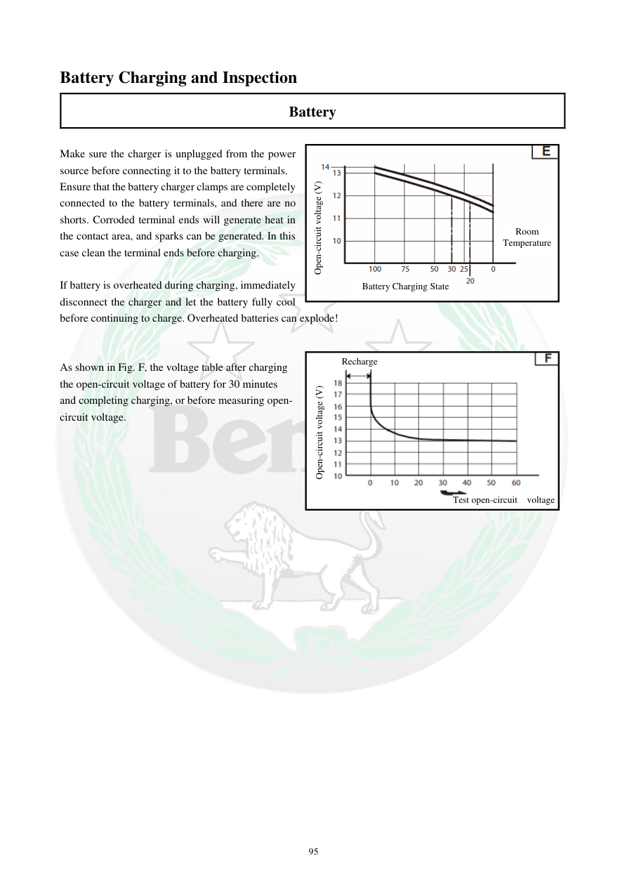

# Manual page 96

> Source: [page-0096.md](../source/page-0096.md)

## Page image / diagram

- [page-0096-img-01.png](../images/embedded/page-0096-img-01.png)

- [page-0096-img-02.png](../images/embedded/page-0096-img-02.png)

- [page-0096-img-03.png](../images/embedded/page-0096-img-03.png)

- [page-0096-img-04.png](../images/embedded/page-0096-img-04.png)

- [page-0096-img-05.png](../images/embedded/page-0096-img-05.png)

- [page-0096-img-08.png](../images/embedded/page-0096-img-08.png)

## Extracted text

# Source page 96

 
95 
Battery Charging and Inspection  
Battery  
 
Make sure the charger is unplugged from the power 
source before connecting it to the battery terminals.  
Ensure that the battery charger clamps are completely 
connected to the battery terminals, and there are no 
shorts. Corroded terminal ends will generate heat in 
the contact area, and sparks can be generated. In this 
case clean the terminal ends before charging.   
 
If battery is overheated during charging, immediately 
disconnect the charger and let the battery fully cool 
before continuing to charge. Overheated batteries can explode!  
 
 
As shown in Fig. F, the voltage table after charging 
the open-circuit voltage of battery for 30 minutes 
and completing charging, or before measuring open-
circuit voltage.  
 
 
 
 
 
Open-circuit voltage (V) 
Recharge 
Test open-circuit  voltage 
Open-circuit voltage (V) 
Battery Charging State 
Room 
Temperature

## Persian notes

### کنترل باتری پس از شارژ
- قبل از اتصال گیره‌های شارژر، شارژر باید از منبع برق جدا باشد.
- اتصال گیره‌ها باید محکم و بدون اتصال کوتاه باشد.
- ترمینال‌های خورده یا کثیف می‌توانند باعث گرم‌شدن محل اتصال و ایجاد جرقه شوند؛ در صورت وجود خوردگی، ترمینال‌ها باید تمیز شوند.
- اگر باتری هنگام شارژ بیش از حد گرم شد، شارژ را متوقف کرده و اجازه دهید کاملاً خنک شود.
- نمودار صفحه رابطه ولتاژ مدار باز، وضعیت شارژ و دمای محیط را نشان می‌دهد؛ برای خواندن دقیق نمودار، تصویر اصلی صفحه مرجع پروژه است.

