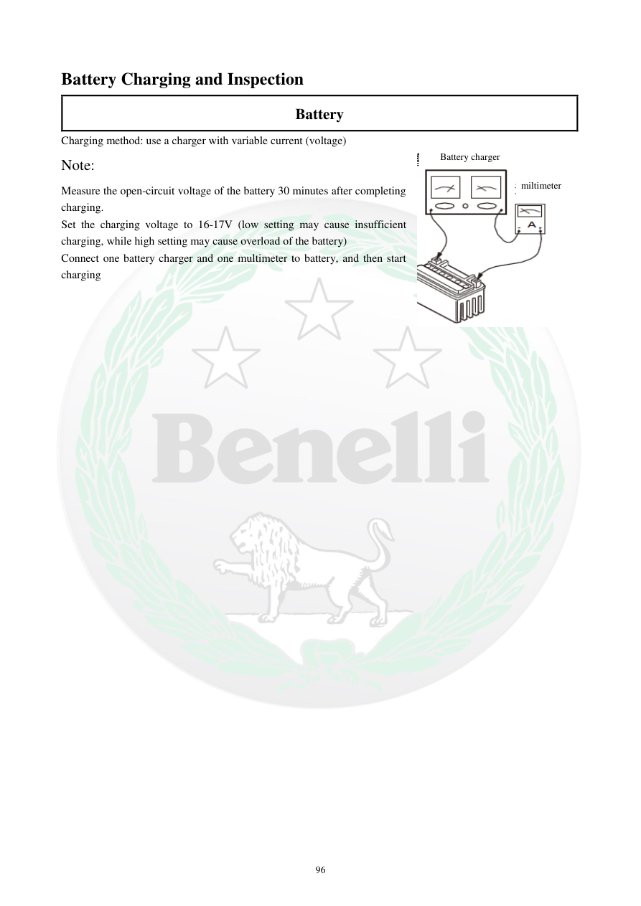

# Manual page 97

> Source: [page-0097.md](../source/page-0097.md)

## Page image / diagram

- [page-0097-img-01.png](../images/embedded/page-0097-img-01.png)

- [page-0097-img-02.png](../images/embedded/page-0097-img-02.png)

- [page-0097-img-03.png](../images/embedded/page-0097-img-03.png)

## Extracted text

# Source page 97

 
96 
Battery Charging and Inspection 
Battery  
Charging method: use a charger with variable current (voltage)  
Note:  
Measure the open-circuit voltage of the battery 30 minutes after completing 
charging.  
Set the charging voltage to 16-17V (low setting may cause insufficient 
charging, while high setting may cause overload of the battery) 
Connect one battery charger and one multimeter to battery, and then start 
charging 
Battery charger 
miltimeter

## Persian notes

### روش شارژ با شارژر قابل تنظیم
- دفترچه استفاده از شارژری با جریان/ولتاژ قابل تنظیم را توضیح می‌دهد.
- ولتاژ مدار باز باتری را **30 دقیقه پس از پایان شارژ** اندازه‌گیری کنید.
- در این صفحه ولتاژ شارژ **16 تا 17 V** ذکر شده است.
- مقدار کمتر می‌تواند باعث شارژ ناکافی و مقدار بیشتر باعث اضافه‌بار باتری شود.
- یک شارژر و یک مولتی‌متر طبق شکل به باتری متصل می‌شوند.
- **نکته مهم پروژه:** اعداد شارژ این صفحه باید همراه با نوع و مشخصات واقعی باتری نصب‌شده بررسی شوند؛ این مقادیر را برای باتری دیگری بدون تطبیق استفاده نکنید.

