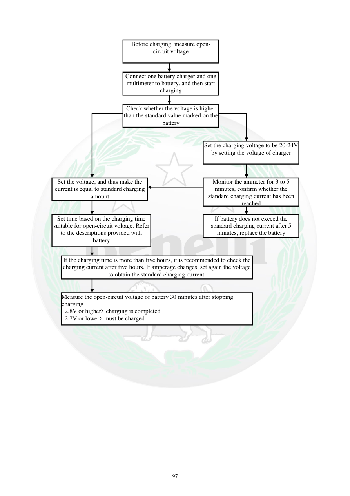

# Manual page 98

> Source: [page-0098.md](../source/page-0098.md)

## Page image / diagram

- [page-0098-img-01.png](../images/embedded/page-0098-img-01.png)

- [page-0098-img-02.png](../images/embedded/page-0098-img-02.png)

- [page-0098-img-04.png](../images/embedded/page-0098-img-04.png)

- [page-0098-img-06.png](../images/embedded/page-0098-img-06.png)

- [page-0098-img-07.png](../images/embedded/page-0098-img-07.png)

- [page-0098-img-08.png](../images/embedded/page-0098-img-08.png)

- [page-0098-img-09.png](../images/embedded/page-0098-img-09.png)

## Extracted text

# Source page 98

 
97 
 
 
 
 
 
 
 
 
 
Before charging, measure open-
circuit voltage 
Connect one battery charger and one 
multimeter to battery, and then start 
charging 
Check whether the voltage is higher 
than the standard value marked on the 
battery 
Set the charging voltage to be 20-24V 
by setting the voltage of charger 
Set the voltage, and thus make the 
current is equal to standard charging 
amount 
Set time based on the charging time 
suitable for open-circuit voltage. Refer 
to the descriptions provided with 
battery 
If battery does not exceed the 
standard charging current after 5 
minutes, replace the battery  
If the charging time is more than five hours, it is recommended to check the 
charging current after five hours. If amperage changes, set again the voltage 
to obtain the standard charging current. 
Measure the open-circuit voltage of battery 30 minutes after stopping 
charging   
12.8V or higher> charging is completed  
12.7V or lower> must be charged 
Monitor the ammeter for 3 to 5 
minutes, confirm whether the 
standard charging current has been 
reached

## Persian notes

### نمودار و روند شارژ باتری
- ابتدا ولتاژ مدار باز اندازه‌گیری می‌شود.
- شارژر و مولتی‌متر طبق نمودار به باتری متصل می‌شوند.
- روند تنظیم ولتاژ و جریان باید مطابق مشخصات شارژ همان باتری باشد.
- متن صفحه چند مرحله برای پایش جریان و زمان شارژ ارائه می‌کند و توصیه می‌کند اگر پس از چند دقیقه جریان به مقدار استاندارد نمی‌رسد، وضعیت باتری بررسی شود.
- پس از توقف شارژ، ولتاژ مدار باز **30 دقیقه بعد** اندازه‌گیری می‌شود.
- طبق متن صفحه: **12.8 V یا بیشتر** به‌عنوان تکمیل شارژ و **12.7 V یا کمتر** به‌عنوان نیاز به شارژ مجدد ذکر شده است.
- به دلیل وابستگی نمودار به نوع باتری، دما و جریان، **تصویر نمودار صفحه مرجع اصلی این بخش است**.

