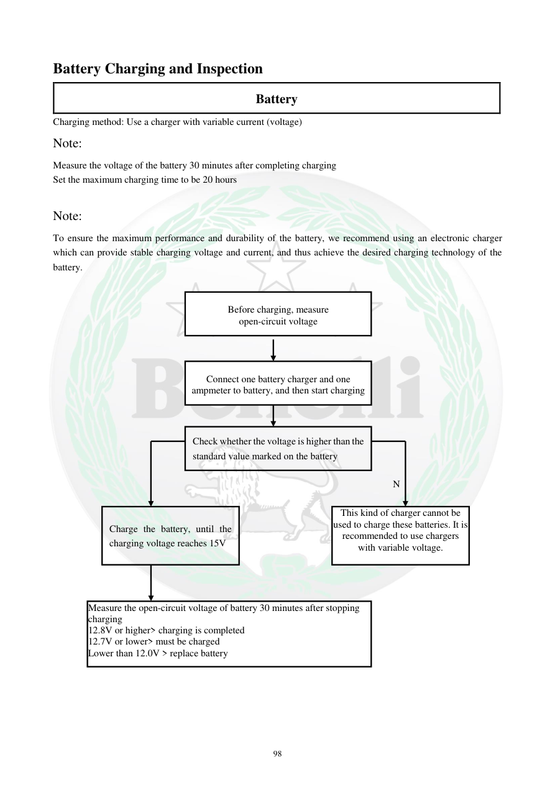

# Manual page 99

> Source: [page-0099.md](../source/page-0099.md)

## Page image / diagram

- [page-0099-img-01.png](../images/embedded/page-0099-img-01.png)

- [page-0099-img-02.png](../images/embedded/page-0099-img-02.png)

- [page-0099-img-03.png](../images/embedded/page-0099-img-03.png)

- [page-0099-img-04.png](../images/embedded/page-0099-img-04.png)

- [page-0099-img-05.png](../images/embedded/page-0099-img-05.png)

- [page-0099-img-06.png](../images/embedded/page-0099-img-06.png)

## Extracted text

# Source page 99

 
98 
Battery Charging and Inspection 
Battery  
Charging method: Use a charger with variable current (voltage)  
Note:  
Measure the voltage of the battery 30 minutes after completing charging  
Set the maximum charging time to be 20 hours 
 
Note:  
To ensure the maximum performance and durability of the battery, we recommend using an electronic charger 
which can provide stable charging voltage and current, and thus achieve the desired charging technology of the 
battery.  
 
 
 
 
 
 
Connect one battery charger and one 
ampmeter to battery, and then start charging 
Check whether the voltage is higher than the 
standard value marked on the battery 
This kind of charger cannot be 
used to charge these batteries. It is 
recommended to use chargers 
with variable voltage. 
Charge the battery, until the 
charging voltage reaches 15V 
Measure the open-circuit voltage of battery 30 minutes after stopping 
charging   
12.8V or higher> charging is completed  
12.7V or lower> must be charged 
Lower than 12.0V > replace battery 
N 
 
Before charging, measure  
open-circuit voltage

## Persian notes

<!-- Persian translation/explanation will be added here. -->
