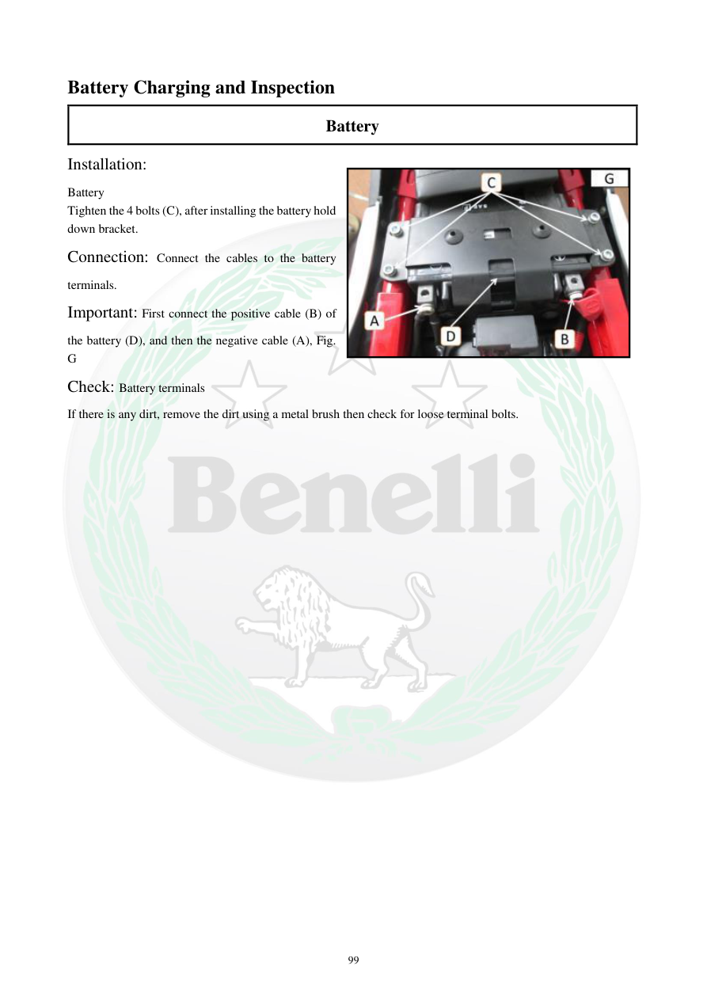

# Manual page 100

> Source: [page-0100.md](../source/page-0100.md)

## Page image / diagram

- [page-0100-img-01.jpeg](../images/embedded/page-0100-img-01.jpeg)

## Extracted text

# Source page 100

 
99 
Battery Charging and Inspection 
Battery  
Installation: 
Battery  
Tighten the 4 bolts (C), after installing the battery hold 
down bracket.  
Connection: Connect the cables to the battery 
terminals.  
Important: First connect the positive cable (B) of 
the battery (D), and then the negative cable (A), Fig. 
G 
Check: Battery terminals  
If there is any dirt, remove the dirt using a metal brush then check for loose terminal bolts.

## Persian notes

<!-- Persian translation/explanation will be added here. -->
