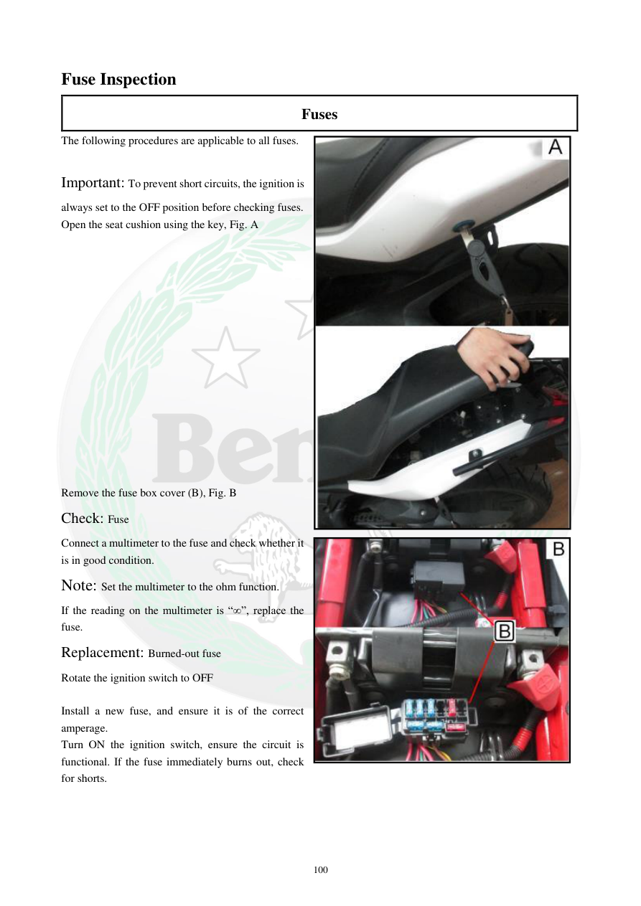

# Manual page 101

> Source: [page-0101.md](../source/page-0101.md)

## Page image / diagram

- [page-0101-img-01.jpeg](../images/embedded/page-0101-img-01.jpeg)

- [page-0101-img-02.jpeg](../images/embedded/page-0101-img-02.jpeg)

## Extracted text

# Source page 101

 
100 
Fuse Inspection 
Fuses  
The following procedures are applicable to all fuses. 
 
Important: To prevent short circuits, the ignition is 
always set to the OFF position before checking fuses.   
Open the seat cushion using the key, Fig. A  
 
 
 
 
 
 
 
 
 
 
 
 
 
 
 
Remove the fuse box cover (B), Fig. B  
Check: Fuse  
Connect a multimeter to the fuse and check whether it 
is in good condition.  
Note: Set the multimeter to the ohm function.  
If the reading on the multimeter is “∞”, replace the 
fuse.  
Replacement: Burned-out fuse  
Rotate the ignition switch to OFF 
 
Install a new fuse, and ensure it is of the correct 
amperage. 
Turn ON the ignition switch, ensure the circuit is 
functional. If the fuse immediately burns out, check 
for shorts.

## Persian notes

<!-- Persian translation/explanation will be added here. -->
