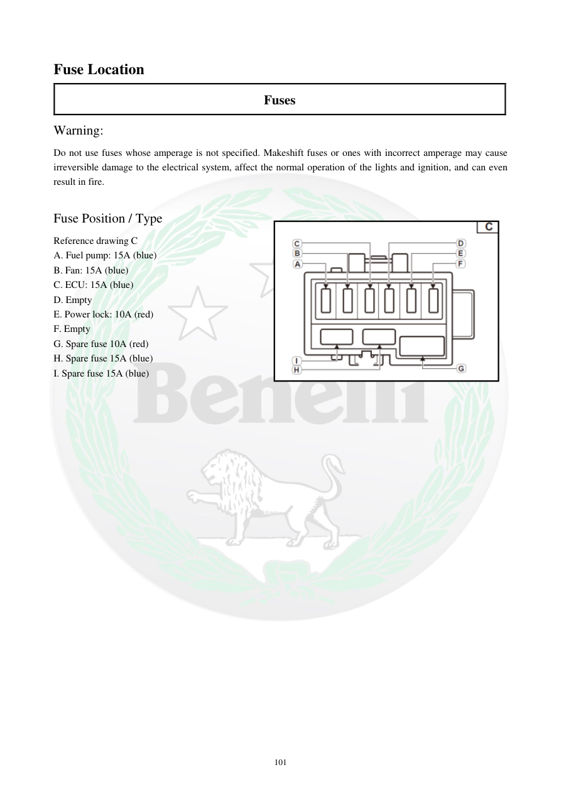

# Manual page 102

> Source: [page-0102.md](../source/page-0102.md)

## Page image / diagram

- [page-0102-img-01.png](../images/embedded/page-0102-img-01.png)

## Extracted text

# Source page 102

 
101 
Fuse Location  
Fuses  
Warning:  
Do not use fuses whose amperage is not specified. Makeshift fuses or ones with incorrect amperage may cause 
irreversible damage to the electrical system, affect the normal operation of the lights and ignition, and can even 
result in fire.  
 
Fuse Position / Type  
Reference drawing C  
A. Fuel pump: 15A (blue) 
B. Fan: 15A (blue) 
C. ECU: 15A (blue) 
D. Empty 
E. Power lock: 10A (red) 
F. Empty 
G. Spare fuse 10A (red) 
H. Spare fuse 15A (blue) 
I. Spare fuse 15A (blue)

## Persian notes

<!-- Persian translation/explanation will be added here. -->
