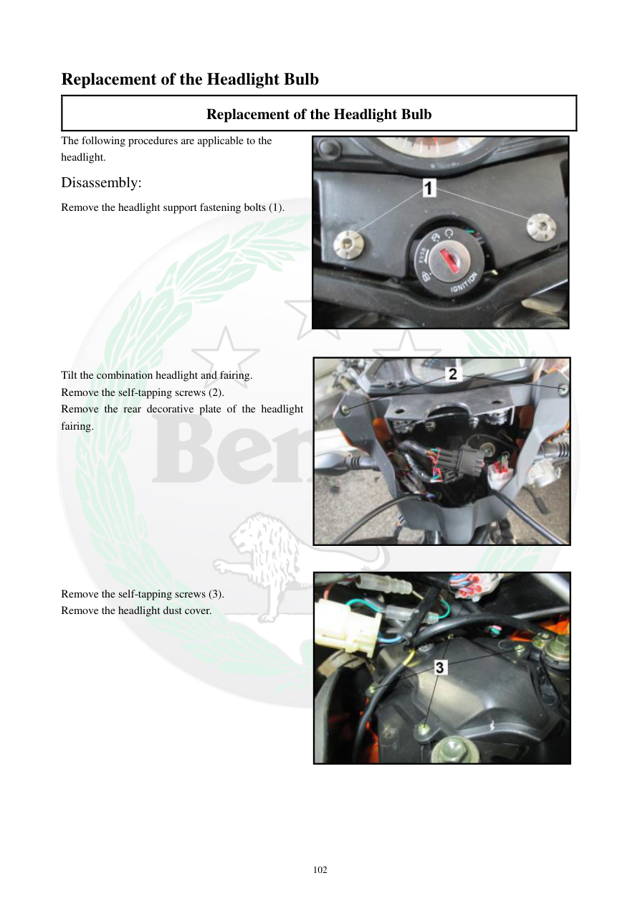

# Manual page 103

> Source: [page-0103.md](../source/page-0103.md)

## Page image / diagram

- [page-0103-img-01.jpeg](../images/embedded/page-0103-img-01.jpeg)

- [page-0103-img-02.jpeg](../images/embedded/page-0103-img-02.jpeg)

- [page-0103-img-03.jpeg](../images/embedded/page-0103-img-03.jpeg)

## Extracted text

# Source page 103

 
102 
Replacement of the Headlight Bulb  
Replacement of the Headlight Bulb 
The following procedures are applicable to the 
headlight.  
Disassembly:  
Remove the headlight support fastening bolts (1).  
 
 
 
 
 
 
 
 
 
Tilt the combination headlight and fairing.  
Remove the self-tapping screws (2). 
Remove the rear decorative plate of the headlight 
fairing.  
 
 
 
 
 
 
 
 
 
Remove the self-tapping screws (3).  
Remove the headlight dust cover.

## Persian notes

<!-- Persian translation/explanation will be added here. -->
