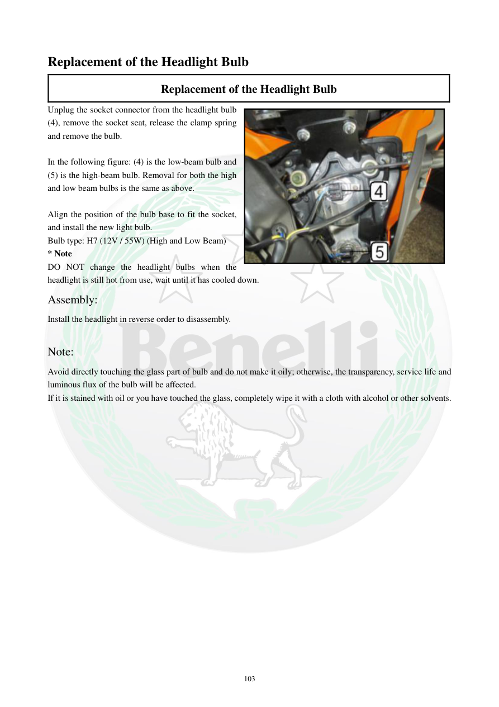

# Manual page 104

> Source: [page-0104.md](../source/page-0104.md)

## Page image / diagram

- [page-0104-img-01.jpeg](../images/embedded/page-0104-img-01.jpeg)

## Extracted text

# Source page 104

 
103 
Replacement of the Headlight Bulb 
Replacement of the Headlight Bulb 
Unplug the socket connector from the headlight bulb 
(4), remove the socket seat, release the clamp spring 
and remove the bulb.  
 
In the following figure: (4) is the low-beam bulb and 
(5) is the high-beam bulb. Removal for both the high 
and low beam bulbs is the same as above.   
 
Align the position of the bulb base to fit the socket, 
and install the new light bulb.  
Bulb type: H7 (12V / 55W) (High and Low Beam) 
* Note  
DO NOT change the headlight bulbs when the 
headlight is still hot from use, wait until it has cooled down. 
Assembly:  
Install the headlight in reverse order to disassembly.  
 
Note:  
Avoid directly touching the glass part of bulb and do not make it oily; otherwise, the transparency, service life and 
luminous flux of the bulb will be affected.  
If it is stained with oil or you have touched the glass, completely wipe it with a cloth with alcohol or other solvents.

## Persian notes

### تعویض لامپ چراغ جلو
- سوکت لامپ را جدا کنید، جای سوکت را خارج کنید، فنر نگهدارنده را آزاد کرده و لامپ را بیرون بیاورید.
- **(4)** مربوط به نور پایین و **(5)** مربوط به نور بالا است و روش باز کردن هر دو مشابه است.
- پایه لامپ جدید را با سوکت هم‌راستا کنید و آن را نصب کنید.
- نوع لامپ طبق دفترچه: **H7، 12V / 55W** برای نور بالا و پایین.
- لامپ را وقتی چراغ داغ است تعویض نکنید؛ صبر کنید کاملاً خنک شود.
- به قسمت شیشه‌ای لامپ دست نزنید و آن را چرب نکنید. در صورت تماس یا آلودگی، شیشه را با پارچه و الکل یا حلال مناسب کاملاً تمیز کنید.
- مونتاژ در ترتیب معکوس بازکردن انجام می‌شود.

