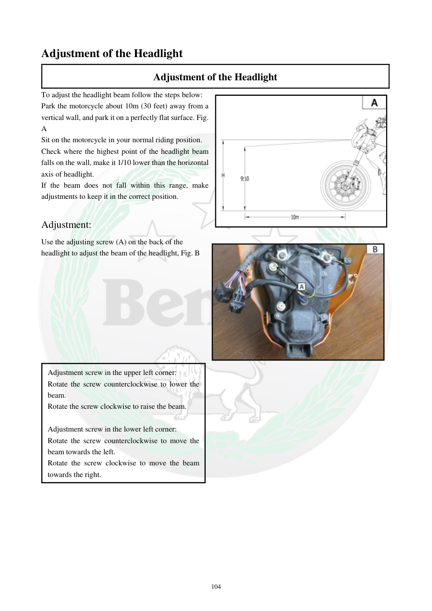

# Manual page 105

> Source: [page-0105.md](../source/page-0105.md)

## Page image / diagram

- [page-0105-img-01.jpeg](../images/embedded/page-0105-img-01.jpeg)

- [page-0105-img-02.png](../images/embedded/page-0105-img-02.png)

## Extracted text

# Source page 105

 
104 
Adjustment of the Headlight  
Adjustment of the Headlight  
To adjust the headlight beam follow the steps below:  
Park the motorcycle about 10m (30 feet) away from a 
vertical wall, and park it on a perfectly flat surface. Fig. 
A  
Sit on the motorcycle in your normal riding position.  
Check where the highest point of the headlight beam 
falls on the wall, make it 1/10 lower than the horizontal 
axis of headlight.  
If the beam does not fall within this range, make 
adjustments to keep it in the correct position.  
 
Adjustment:  
Use the adjusting screw (A) on the back of the 
headlight to adjust the beam of the headlight, Fig. B  
 
 
  
 
 
 
Adjustment screw in the upper left corner: 
Rotate the screw counterclockwise to lower the 
beam. 
Rotate the screw clockwise to raise the beam. 
 
Adjustment screw in the lower left corner:  
Rotate the screw counterclockwise to move the 
beam towards the left.  
Rotate the screw clockwise to move the beam 
towards the right.

## Persian notes

### تنظیم ارتفاع و جهت نور چراغ جلو
- موتور سیکلت را حدود **10 متر** مقابل یک دیوار عمودی و روی سطح کاملاً صاف قرار دهید.
- روی موتور در وضعیت عادی رانندگی بنشینید.
- بالاترین نقطه پرتو چراغ باید حدود **یک‌دهم پایین‌تر از محور افقی چراغ** روی دیوار قرار بگیرد.
- اگر پرتو در این محدوده نیست، با پیچ تنظیم **A** پشت چراغ آن را تنظیم کنید.
- پیچ تنظیم گوشه بالای چپ:
  - خلاف عقربه‌های ساعت → پایین آوردن پرتو
  - در جهت عقربه‌های ساعت → بالا بردن پرتو
- پیچ تنظیم گوشه پایین چپ:
  - خلاف عقربه‌های ساعت → حرکت پرتو به چپ
  - در جهت عقربه‌های ساعت → حرکت پرتو به راست
- تصویر **B** برای شناسایی پیچ‌های تنظیم مرجع اصلی است.

