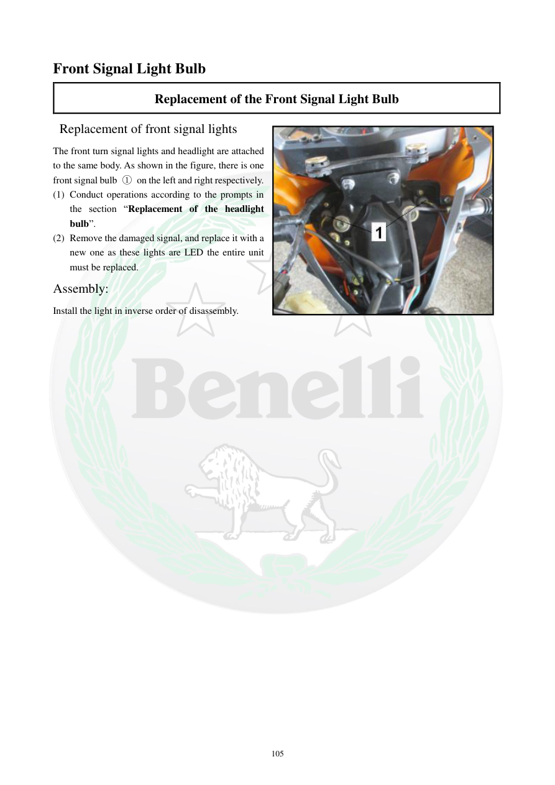

# Manual page 106

> Source: [page-0106.md](../source/page-0106.md)

## Page image / diagram

- [page-0106-img-01.jpeg](../images/embedded/page-0106-img-01.jpeg)

## Extracted text

# Source page 106

 
105 
Front Signal Light Bulb  
Replacement of the Front Signal Light Bulb 
 Replacement of front signal lights 
The front turn signal lights and headlight are attached 
to the same body. As shown in the figure, there is one 
front signal bulb ① on the left and right respectively.  
(1) Conduct operations according to the prompts in 
the section “Replacement of the headlight 
bulb”.  
(2) Remove the damaged signal, and replace it with a 
new one as these lights are LED the entire unit 
must be replaced.  
Assembly:  
Install the light in inverse order of disassembly.

## Persian notes

### تعویض چراغ راهنمای جلو
- چراغ‌های راهنمای جلو و چراغ اصلی جلو روی یک مجموعه قرار دارند.
- برای دسترسی، مراحل بخش تعویض چراغ جلو را دنبال کنید.
- طبق دفترچه، چراغ راهنما از نوع **LED** است و در صورت خرابی، **کل واحد** باید تعویض شود.
- مونتاژ چراغ جدید در ترتیب معکوس بازکردن انجام می‌شود.

