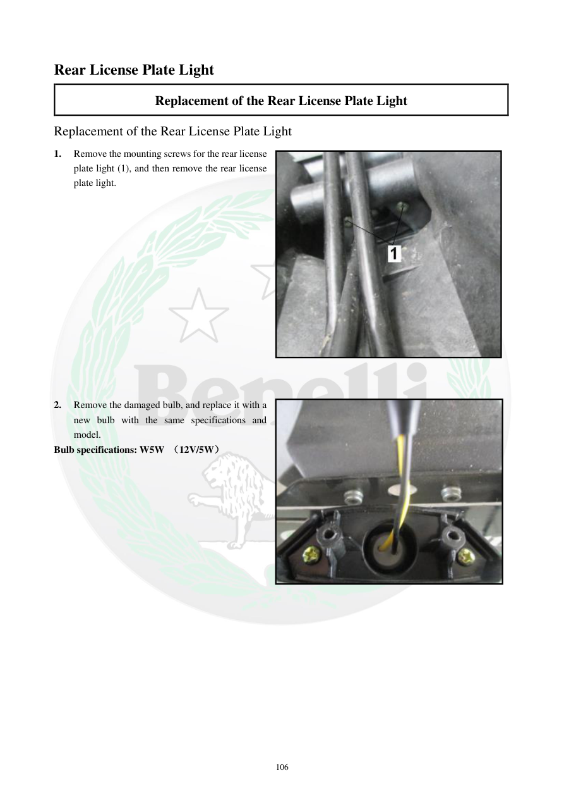

# Manual page 107

> Source: [page-0107.md](../source/page-0107.md)

## Page image / diagram

- [page-0107-img-01.jpeg](../images/embedded/page-0107-img-01.jpeg)

- [page-0107-img-02.jpeg](../images/embedded/page-0107-img-02.jpeg)

## Extracted text

# Source page 107

 
106 
Rear License Plate Light  
Replacement of the Rear License Plate Light 
Replacement of the Rear License Plate Light 
1. 
Remove the mounting screws for the rear license 
plate light (1), and then remove the rear license 
plate light.  
 
 
 
 
 
 
 
 
 
 
 
 
 
 
2. 
Remove the damaged bulb, and replace it with a 
new bulb with the same specifications and 
model. 
Bulb specifications: W5W （12V/5W）

## Persian notes

### تعویض چراغ پلاک عقب
- پیچ‌های نصب چراغ پلاک عقب را باز کنید و مجموعه چراغ را خارج کنید.
- لامپ آسیب‌دیده را خارج کرده و لامپی با همان مشخصات و مدل نصب کنید.
- مشخصات لامپ طبق دفترچه: **W5W، 12V / 5W**.

