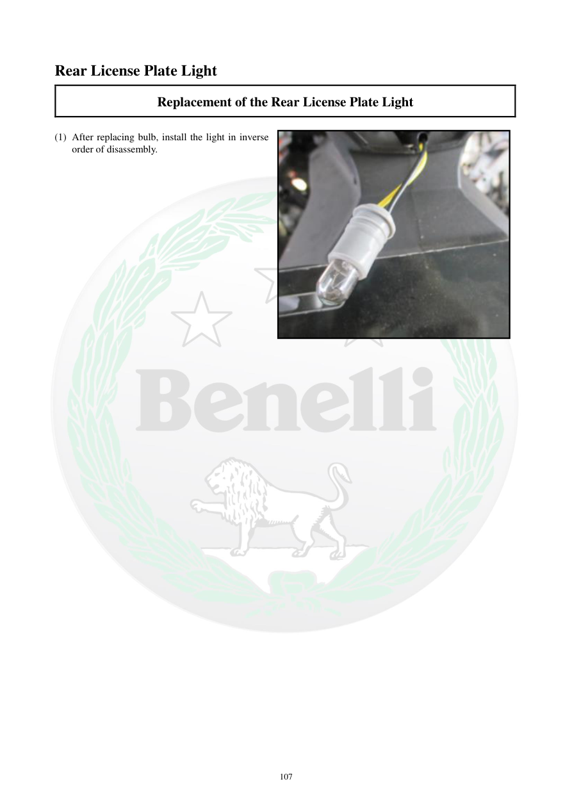

# Manual page 108

> Source: [page-0108.md](../source/page-0108.md)

## Page image / diagram

- [page-0108-img-01.jpeg](../images/embedded/page-0108-img-01.jpeg)

## Extracted text

# Source page 108

 
107 
Rear License Plate Light 
Replacement of the Rear License Plate Light 
 
(1) After replacing bulb, install the light in inverse 
order of disassembly.

## Persian notes

### تکمیل نصب چراغ پلاک عقب
- پس از تعویض لامپ، مجموعه چراغ پلاک را در **ترتیب معکوس بازکردن** نصب کنید.
- این صفحه ادامه دستورالعمل صفحه ۱۰۷ است.

