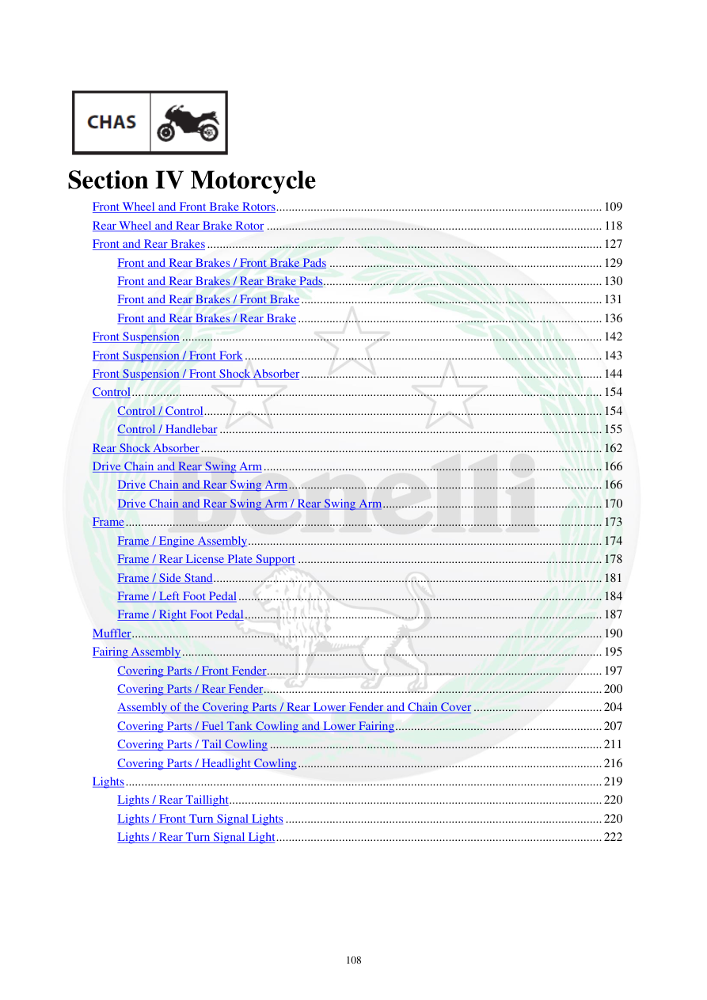

# Manual page 109

> Source: [page-0109.md](../source/page-0109.md)

## Page image / diagram

## Extracted text

# Source page 109

 
108 
 
 
Section IV Motorcycle  
Front Wheel and Front Brake Rotors ........................................................................................................ 109 
Rear Wheel and Rear Brake Rotor ........................................................................................................... 118 
Front and Rear Brakes .............................................................................................................................. 127 
Front and Rear Brakes / Front Brake Pads ....................................................................................... 129 
Front and Rear Brakes / Rear Brake Pads ......................................................................................... 130 
Front and Rear Brakes / Front Brake ................................................................................................ 131 
Front and Rear Brakes / Rear Brake ................................................................................................. 136 
Front Suspension ...................................................................................................................................... 142 
Front Suspension / Front Fork .................................................................................................................. 143 
Front Suspension / Front Shock Absorber ................................................................................................ 144 
Control ...................................................................................................................................................... 154 
Control / Control ............................................................................................................................... 154 
Control / Handlebar .......................................................................................................................... 155 
Rear Shock Absorber ................................................................................................................................ 162 
Drive Chain and Rear Swing Arm ............................................................................................................ 166 
Drive Chain and Rear Swing Arm .................................................................................................... 166 
Drive Chain and Rear Swing Arm / Rear Swing Arm ...................................................................... 170 
Frame ........................................................................................................................................................ 173 
Frame / Engine Assembly ................................................................................................................. 174 
Frame / Rear License Plate Support ................................................................................................. 178 
Frame / Side Stand ............................................................................................................................ 181 
Frame / Left Foot Pedal .................................................................................................................... 184 
Frame / Right Foot Pedal .................................................................................................................. 187 
Muffler ...................................................................................................................................................... 190 
Fairing Assembly ...................................................................................................................................... 195 
Covering Parts / Front Fender ........................................................................................................... 197 
Covering Parts / Rear Fender ............................................................................................................ 200 
Assembly of the Covering Parts / Rear Lower Fender and Chain Cover ......................................... 204 
Covering Parts / Fuel Tank Cowling and Lower Fairing .................................................................. 207 
Covering Parts / Tail Cowling .......................................................................................................... 211 
Covering Parts / Headlight Cowling ................................................................................................. 216 
Lights ........................................................................................................................................................ 219 
Lights / Rear Taillight ....................................................................................................................... 220 
Lights / Front Turn Signal Lights ..................................................................................................... 220 
Lights / Rear Turn Signal Light ........................................................................................................ 222

## Persian notes

### فصل چهارم: موتورسیکلت
این صفحه فهرست مطالب فصل چهارم است. بخش‌های اصلی آن شامل:
- چرخ جلو و دیسک ترمز جلو
- چرخ عقب و دیسک ترمز عقب
- ترمزهای جلو و عقب و لنت‌ها
- تعلیق جلو و دوشاخ جلو
- کنترل‌ها و فرمان
- کمک‌فنر عقب
- زنجیر انتقال و بازوی نوسان عقب
- شاسی و مجموعه نصب موتور
- پایه بغل و پدال‌های چپ و راست
- اگزوز
- فلاپ‌ها و قطعات بدنه
- چراغ‌ها و چراغ‌های راهنما

از این صفحه به بعد وارد بخش **Chassis / Motorcycle** دفترچه می‌شویم. ساختار و شماره صفحات مرجع هستند.

