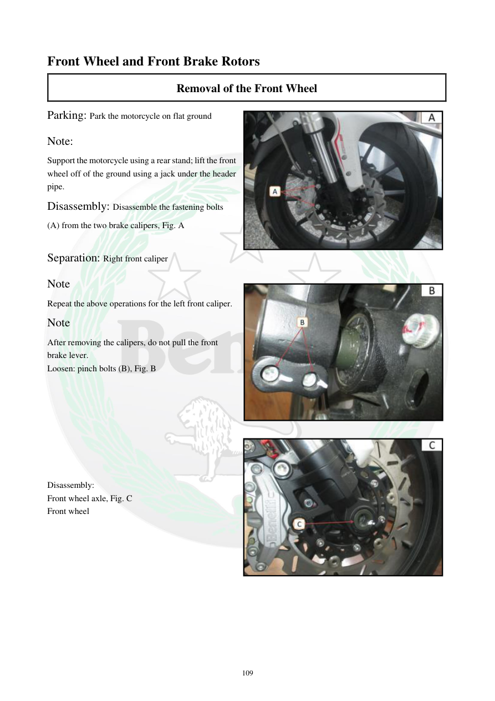

# Manual page 110

> Source: [page-0110.md](../source/page-0110.md)

## Page image / diagram

- [page-0110-img-01.jpeg](../images/embedded/page-0110-img-01.jpeg)

- [page-0110-img-02.jpeg](../images/embedded/page-0110-img-02.jpeg)

- [page-0110-img-03.jpeg](../images/embedded/page-0110-img-03.jpeg)

## Extracted text

# Source page 110

 
109 
Front Wheel and Front Brake Rotors 
Removal of the Front Wheel  
Parking: Park the motorcycle on flat ground  
Note:  
Support the motorcycle using a rear stand; lift the front 
wheel off of the ground using a jack under the header 
pipe.  
Disassembly: Disassemble the fastening bolts 
(A) from the two brake calipers, Fig. A 
 
Separation: Right front caliper 
Note 
Repeat the above operations for the left front caliper.  
Note  
After removing the calipers, do not pull the front 
brake lever.  
Loosen: pinch bolts (B), Fig. B  
 
 
 
 
 
 
 
 
Disassembly:  
Front wheel axle, Fig. C 
Front wheel

## Persian notes

### باز کردن چرخ جلو
- موتور را روی سطح صاف قرار دهید و با **پایه عقب** مهار کنید.
- برای بلند کردن چرخ جلو، دفترچه استفاده از جک زیر قسمت هدر اگزوز را نشان می‌دهد.
- پیچ‌های اتصال هر دو کالیپر ترمز جلو **(A)** را باز کنید.
- همین کار را برای کالیپر سمت دیگر انجام دهید.
- پس از خارج کردن کالیپرها، **اهرم ترمز جلو را فشار ندهید**.
- پیچ‌های گیره محور **(B)** را شل کنید.
- سپس محور چرخ جلو و خود چرخ را خارج کنید.
- تصویر صفحه برای تشخیص محل کالیپرها، پیچ‌های گیره و محور مرجع است.

