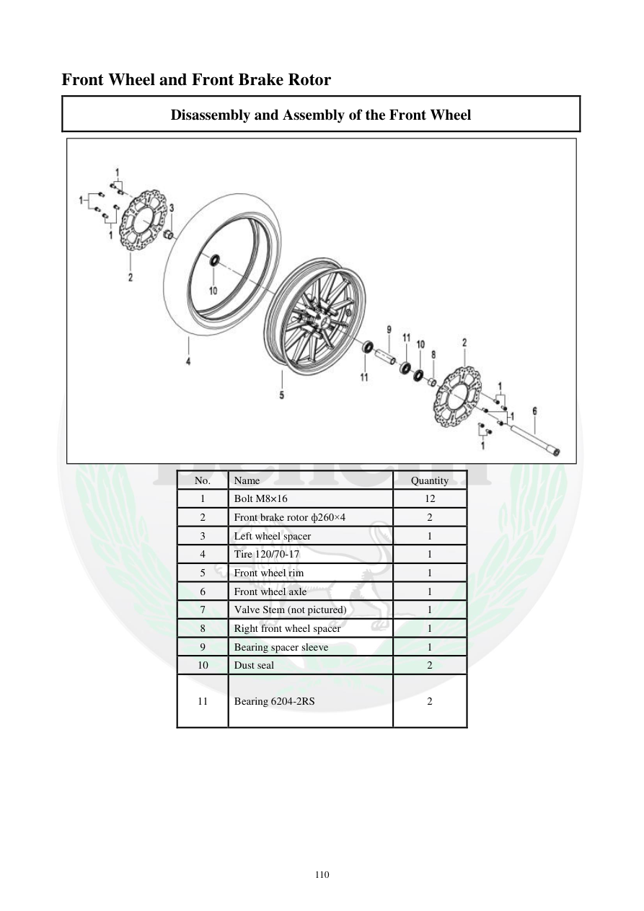

# Manual page 111

> Source: [page-0111.md](../source/page-0111.md)

## Page image / diagram

- [page-0111-img-01.jpeg](../images/embedded/page-0111-img-01.jpeg)

## Extracted text

# Source page 111

 
110 
Front Wheel and Front Brake Rotor 
Disassembly and Assembly of the Front Wheel  
 
No.  
Name  
Quantity  
1 
Bolt M8×16 
12 
2 
Front brake rotor ф260×4 
2 
3 
Left wheel spacer  
1 
4 
Tire 120/70-17 
1 
5 
Front wheel rim  
1 
6 
Front wheel axle  
1 
7 
Valve Stem (not pictured) 
1 
8 
Right front wheel spacer 
1 
9 
Bearing spacer sleeve  
1 
10 
Dust seal  
2 
11 
Bearing 6204-2RS 
2

## Persian notes

<!-- Persian translation/explanation will be added here. -->
