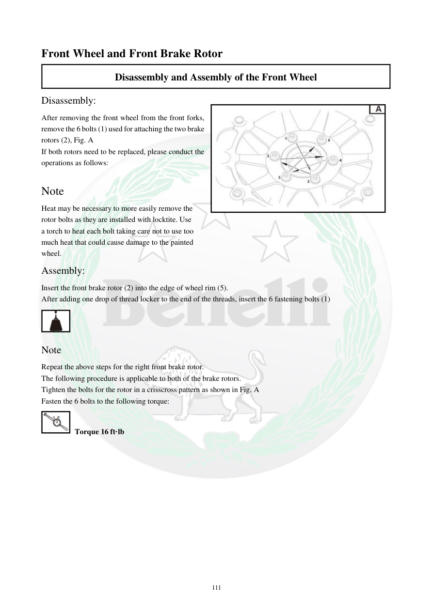

# Manual page 112

> Source: [page-0112.md](../source/page-0112.md)

## Page image / diagram

- [page-0112-img-01.png](../images/embedded/page-0112-img-01.png)

- [page-0112-img-02.png](../images/embedded/page-0112-img-02.png)

- [page-0112-img-03.jpeg](../images/embedded/page-0112-img-03.jpeg)

## Extracted text

# Source page 112

 
111 
Front Wheel and Front Brake Rotor 
Disassembly and Assembly of the Front Wheel 
Disassembly:  
After removing the front wheel from the front forks, 
remove the 6 bolts (1) used for attaching the two brake 
rotors (2), Fig. A  
If both rotors need to be replaced, please conduct the 
operations as follows:  
 
Note  
Heat may be necessary to more easily remove the 
rotor bolts as they are installed with locktite. Use  
a torch to heat each bolt taking care not to use too  
much heat that could cause damage to the painted  
wheel. 
Assembly:  
Insert the front brake rotor (2) into the edge of wheel rim (5).  
After adding one drop of thread locker to the end of the threads, insert the 6 fastening bolts (1)  
 
Note 
Repeat the above steps for the right front brake rotor.  
The following procedure is applicable to both of the brake rotors.  
Tighten the bolts for the rotor in a crisscross pattern as shown in Fig. A  
Fasten the 6 bolts to the following torque:  
 Torque 16 ft·lb

## Persian notes

<!-- Persian translation/explanation will be added here. -->
