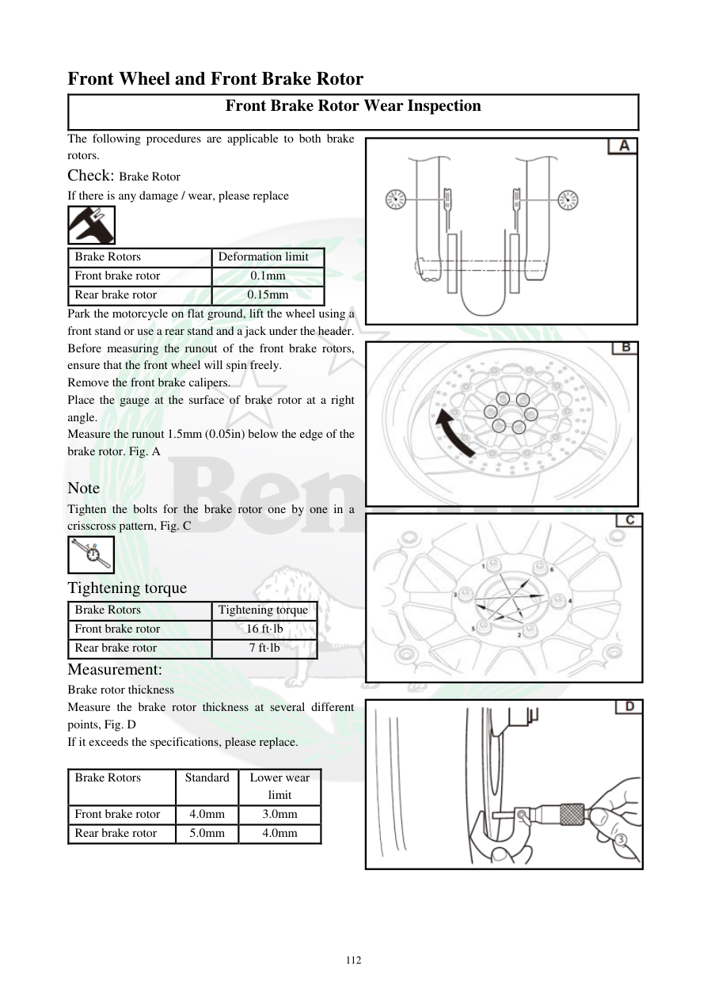

# Manual page 113

> Source: [page-0113.md](../source/page-0113.md)

## Page image / diagram

- [page-0113-img-01.png](../images/embedded/page-0113-img-01.png)

- [page-0113-img-02.png](../images/embedded/page-0113-img-02.png)

- [page-0113-img-03.jpeg](../images/embedded/page-0113-img-03.jpeg)

- [page-0113-img-04.png](../images/embedded/page-0113-img-04.png)

- [page-0113-img-05.png](../images/embedded/page-0113-img-05.png)

- [page-0113-img-06.jpeg](../images/embedded/page-0113-img-06.jpeg)

## Extracted text

# Source page 113

 
112 
Front Wheel and Front Brake Rotor 
Front Brake Rotor Wear Inspection 
The following procedures are applicable to both brake 
rotors. 
Check: Brake Rotor  
If there is any damage / wear, please replace 
 
Brake Rotors  
Deformation limit  
Front brake rotor  
0.1mm 
Rear brake rotor 
0.15mm 
Park the motorcycle on flat ground, lift the wheel using a 
front stand or use a rear stand and a jack under the header.  
Before measuring the runout of the front brake rotors, 
ensure that the front wheel will spin freely.  
Remove the front brake calipers. 
Place the gauge at the surface of brake rotor at a right 
angle.  
Measure the runout 1.5mm (0.05in) below the edge of the 
brake rotor. Fig. A  
 
Note  
Tighten the bolts for the brake rotor one by one in a 
crisscross pattern, Fig. C  
 
Tightening torque  
Brake Rotors  
Tightening torque  
Front brake rotor 
16 ft·lb 
Rear brake rotor 
7 ft·lb 
Measurement:  
Brake rotor thickness 
Measure the brake rotor thickness at several different 
points, Fig. D  
If it exceeds the specifications, please replace.   
 
Brake Rotors  
Standard  
Lower wear 
limit  
Front brake rotor  
4.0mm 
3.0mm 
Rear brake rotor 
5.0mm 
4.0mm

## Persian notes

<!-- Persian translation/explanation will be added here. -->
